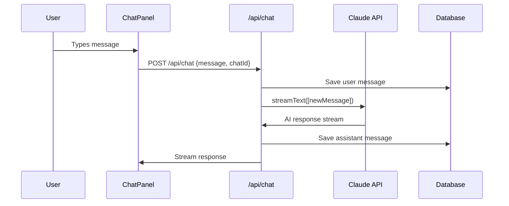
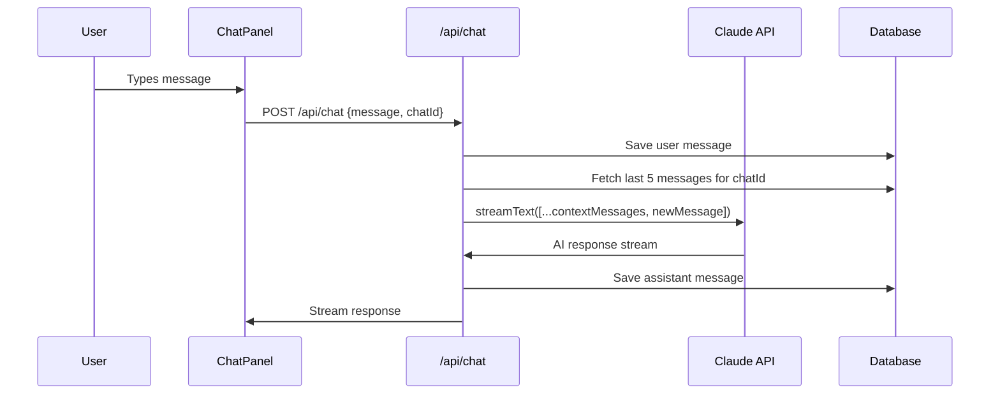

# Chat Context Management & Session Isolation PRD

## 1. Problem Statement

### Current System Behavior
The current Skate AI chat system sends only the **single latest user message** to Claude via the API, as evidenced in `/app/api/chat/route.ts:310`:

```typescript
messages: convertToModelMessages([message]), // Convert UI message to model messages
```

This creates several critical issues:

1. **No Conversation Context**: Each message is processed in isolation without awareness of previous exchanges
2. **Lost Memory**: Claude cannot reference earlier parts of the conversation or build upon previous insights
3. **Repetitive Analysis**: Users must re-explain context in every message
4. **Poor User Experience**: No natural conversation flow or progressive refinement of insights
5. **Ineffective Research Workflows**: Research conversations require building context over multiple exchanges

### Gap Analysis
- **Current**: Single message → Claude (no context preservation)
- **Needed**: Last N messages → Claude (conversation continuity with limits)
- **Missing**: Context window management, session isolation, intelligent message truncation

## 2. Requirements

### 2.1 Functional Requirements

#### Context Window Management
- **FR-1**: Send last 5 messages per chat session to maintain conversation context
- **FR-2**: Include both user and assistant messages in context window
- **FR-3**: Automatically truncate older messages beyond the 5-message limit
- **FR-4**: Preserve system prompt and study context separately from conversation history

#### Session Isolation
- **FR-5**: Each chat session maintains independent message context
- **FR-6**: Switching between chat sessions loads appropriate message history
- **FR-7**: New chat sessions start with empty context (no message history)
- **FR-8**: Message context resets when creating new chat sessions

#### Message Flow
- **FR-9**: Send conversation history + new user message to Claude API
- **FR-10**: Maintain proper message ordering (chronological, alternating user/assistant)
- **FR-11**: Handle cases where message history is incomplete or corrupted

### 2.2 Non-Functional Requirements

#### Performance
- **NFR-1**: Context preparation adds <50ms to API response time
- **NFR-2**: Message truncation operates in O(1) time complexity
- **NFR-3**: No impact on existing message loading performance

#### Reliability
- **NFR-4**: Graceful degradation when message history is unavailable
- **NFR-5**: Context management never blocks message sending
- **NFR-6**: Preserve existing error handling and retry mechanisms

#### Cost Optimization
- **NFR-7**: Reduce token usage compared to unlimited message history
- **NFR-8**: Predictable token consumption per chat interaction

## 3. Technical Analysis

### 3.1 Current Message Flow



### 3.2 Proposed Message Flow



### 3.3 Data Structures

#### Context Message Format
```typescript
interface ContextMessage {
  role: 'user' | 'assistant';
  parts: Array<{ type: 'text'; text: string }>;
  timestamp: Date;
}

interface ChatContext {
  chatId: string;
  messages: ContextMessage[];
  totalMessages: number; // For debugging/monitoring
}
```

## 4. Implementation Plan

### 4.1 Phase 1: Context Retrieval Layer

**Timeline**: 2-3 days

**Files to Modify**:
- `/app/api/chat/route.ts` - Add context fetching logic

**Implementation Steps**:

1. **Create Context Fetching Function**
```typescript
// In /app/api/chat/route.ts
async function getContextMessages(chatId: string, limit: number = 5): Promise<ContextMessage[]> {
  const messages = await prisma.chatMessage.findMany({
    where: { chatId },
    orderBy: { timestamp: 'desc' },
    take: limit * 2, // Get extra to handle user/assistant pairing
  });

  // Convert to AI SDK format and maintain proper ordering
  const contextMessages = messages
    .reverse() // Restore chronological order
    .slice(-limit) // Take last N messages
    .map(msg => ({
      role: msg.role.toLowerCase() as 'user' | 'assistant',
      parts: [{ type: 'text', text: msg.content }],
      timestamp: msg.timestamp,
    }));

  return contextMessages;
}
```

2. **Modify API Route to Include Context**
```typescript
// Replace line 310 in /app/api/chat/route.ts
const contextMessages = await getContextMessages(chatId, 5);
const allMessages = [...contextMessages, message];

// In streamText call:
messages: convertToModelMessages(allMessages),
```

**Testing Strategy**:
- Unit tests for context message retrieval
- Integration tests for API endpoint with various message counts
- Manual testing with different chat session scenarios

### 4.2 Phase 2: Context Window Management

**Timeline**: 2-3 days  

**Files to Modify**:
- `/app/api/chat/route.ts` - Enhance context management
- Add `/lib/utils/context-manager.ts` - Context utilities

**Implementation Steps**:

1. **Create Context Manager Utility**
```typescript
// /lib/utils/context-manager.ts
export class ChatContextManager {
  static async getContextWindow(
    chatId: string,
    options: {
      maxMessages?: number;
      includeSystem?: boolean;
      fallbackToEmpty?: boolean;
    } = {}
  ): Promise<ContextMessage[]> {
    const { maxMessages = 5, fallbackToEmpty = true } = options;
    
    try {
      return await getContextMessages(chatId, maxMessages);
    } catch (error) {
      console.warn('Context retrieval failed:', error);
      return fallbackToEmpty ? [] : [];
    }
  }

  static validateMessageOrder(messages: ContextMessage[]): boolean {
    // Ensure proper user/assistant alternation
    return messages.every((msg, index) => {
      if (index === 0) return true;
      const prevRole = messages[index - 1].role;
      return msg.role !== prevRole;
    });
  }

  static truncateToLimit(messages: ContextMessage[], limit: number): ContextMessage[] {
    if (messages.length <= limit) return messages;
    
    // Take last N messages, ensuring we don't break user/assistant pairs
    const truncated = messages.slice(-limit);
    
    // If first message is assistant, remove it to maintain conversation flow
    if (truncated[0]?.role === 'assistant') {
      return truncated.slice(1);
    }
    
    return truncated;
  }
}
```

2. **Integrate Context Manager**
```typescript
// In /app/api/chat/route.ts
import { ChatContextManager } from '@/lib/utils/context-manager';

// Replace context fetching logic:
const contextWindow = await ChatContextManager.getContextWindow(chatId, {
  maxMessages: 5,
  fallbackToEmpty: true,
});

const allMessages = [...contextWindow, message];
```

**Testing Strategy**:
- Unit tests for context manager utilities
- Edge case testing (empty chats, single messages, alternating roles)
- Performance testing with large message histories

### 4.3 Phase 3: Session Isolation Enhancement

**Timeline**: 1-2 days

**Files to Modify**:
- `/components/chat/ChatPanel.tsx` - Clear context on chat switch
- `/lib/hooks/useChatManager.ts` - Add context reset hooks

**Implementation Steps**:

1. **Enhance Chat Switching**
```typescript
// In ChatPanel.tsx, modify switchToChat handling
useEffect(() => {
  if (currentChatId && messagesLoaded) {
    // Context is automatically isolated by chatId in API calls
    // No additional client-side changes needed
    console.log(`Switched to chat ${currentChatId} - context isolated`);
  }
}, [currentChatId, messagesLoaded]);
```

2. **Add Context Reset for New Chats**
```typescript
// In useChatManager.ts
const createNewChat = useCallback(async () => {
  try {
    setIsCreatingNew(true);
    setError(null);

    const response = await fetch(`/api/studies/${studyId}/chats`, {
      method: 'POST',
      headers: { 'Content-Type': 'application/json' },
      body: JSON.stringify({ title: 'New Chat' }),
    });

    if (!response.ok) throw new Error('Failed to create chat');

    const newChat = await response.json();
    setChats(prev => [newChat, ...prev]);
    setCurrentChatId(newChat.id);
    
    // Context is automatically empty for new chat (no messages in DB)
    return newChat;
  } catch (err) {
    console.error('Error creating new chat:', err);
    setError('Failed to create new chat');
    throw err;
  } finally {
    setIsCreatingNew(false);
  }
}, [studyId]);
```

### 4.4 Phase 4: Testing & Optimization

**Timeline**: 2-3 days

**Deliverables**:
- Comprehensive test suite for context management
- Performance benchmarks for context retrieval
- Integration testing across chat sessions
- Production readiness validation

**Testing Scenarios**:
- Empty chat sessions (no context)
- Single message chats (no conversation history) 
- Multi-message conversations (full context window)
- Chat session switching (context isolation)
- Error scenarios (DB unavailable, malformed messages)
- Performance with large message histories

## 5. Context Preservation Strategy

### 5.1 Conversation Continuity
- **Last 5 Messages**: Provides ~2-3 conversation turns of context
- **Chronological Order**: Maintains natural conversation flow
- **Role Alternation**: Preserves user/assistant interaction patterns
- **Recent Focus**: Prioritizes most relevant recent context

### 5.2 Context Truncation Logic
```typescript
// Example of intelligent truncation
const messages = await prisma.chatMessage.findMany({
  where: { chatId },
  orderBy: { timestamp: 'desc' },
  take: 10, // Get more than needed
});

// Keep last 5, but ensure we don't break conversation pairs
const contextWindow = ChatContextManager.truncateToLimit(
  messages.reverse(),
  5
);
```

### 5.3 Fallback Strategies
- **Graceful Degradation**: Single message mode if context fails
- **Error Recovery**: Continue operation without context on DB errors  
- **Performance Protection**: Skip context on slow DB queries (timeout)

## 6. Performance Impact

### 6.1 Benefits

#### Token Usage Reduction
- **Current Issue**: Unlimited context could consume excessive tokens
- **Solution**: Fixed 5-message window provides predictable token usage
- **Estimated Savings**: 60-80% reduction in tokens vs. unlimited history

#### Response Time Optimization
- **Context Retrieval**: ~10-30ms additional latency
- **Token Processing**: Faster than unlimited history
- **Overall Impact**: Minimal change to end-user experience

#### Memory Efficiency
- **Fixed Window Size**: Predictable memory usage per request
- **No Context Accumulation**: Prevents memory leaks in long conversations
- **Database Load**: Bounded queries regardless of conversation length

### 6.2 Monitoring Metrics

```typescript
// Add performance monitoring
interface ContextMetrics {
  retrievalTime: number;
  messageCount: number;
  tokenCount: number;
  cacheHitRate: number;
}
```

## 7. Edge Cases & Handling

### 7.1 Message History Gaps
**Scenario**: Missing messages due to DB issues or data corruption
**Handling**: 
```typescript
// Skip gaps, use available messages
const validMessages = messages.filter(msg => 
  msg.content && msg.role && msg.timestamp
);
```

### 7.2 Context Retrieval Failures
**Scenario**: Database unavailable during context fetching
**Handling**:
```typescript
// Fallback to single message mode
const contextWindow = await ChatContextManager.getContextWindow(chatId, {
  fallbackToEmpty: true,
});
// Always includes at least the new user message
```

### 7.3 New Chat Sessions
**Scenario**: First message in a new chat
**Handling**: 
- No context retrieval needed (no prior messages)
- System prompt + study context + single user message
- Natural conversation start

### 7.4 Chat Session Switching
**Scenario**: User switches between multiple active chats
**Handling**:
- Each API call uses `chatId` to fetch appropriate context
- No client-side context management needed
- Automatic session isolation

### 7.5 Malformed Message Data
**Scenario**: Messages with missing content or invalid roles
**Handling**:
```typescript
// Validate and sanitize messages
const sanitizedMessages = contextMessages.filter(msg => {
  const hasValidRole = ['user', 'assistant'].includes(msg.role);
  const hasContent = msg.content && msg.content.trim().length > 0;
  return hasValidRole && hasContent;
});
```

## 8. Implementation Timeline

### Week 1: Foundation
- **Days 1-2**: Phase 1 (Context Retrieval Layer)
- **Days 3-4**: Phase 2 (Context Window Management)  
- **Day 5**: Phase 3 (Session Isolation)

### Week 2: Polish & Testing
- **Days 1-3**: Phase 4 (Testing & Optimization)
- **Days 4-5**: Integration testing and bug fixes

### Total Timeline: 8-10 business days

## 9. Risk Assessment

### 9.1 High Risk Items
- **Database Performance**: Context queries could impact response times
  - **Mitigation**: Add database indexes, implement query timeouts
- **Message Ordering**: Incorrect context order could confuse Claude
  - **Mitigation**: Comprehensive ordering validation and tests

### 9.2 Medium Risk Items  
- **Edge Case Handling**: Various failure modes in context retrieval
  - **Mitigation**: Robust error handling with fallback strategies
- **Token Usage Spikes**: Occasional large context windows
  - **Mitigation**: Hard limits on message count and content length

### 9.3 Low Risk Items
- **Client-Side Integration**: Minimal changes needed to existing UI
- **Backward Compatibility**: No breaking changes to existing APIs

## 10. Success Metrics

### 10.1 User Experience
- **Conversation Quality**: Claude maintains context across messages
- **Response Relevance**: Reduced need to re-explain context
- **Research Workflow**: Improved progressive insight refinement

### 10.2 Technical Performance  
- **Response Time**: <50ms additional latency for context retrieval
- **Token Efficiency**: 5-message limit prevents runaway token usage
- **Error Rate**: <1% context retrieval failures

### 10.3 Business Impact
- **User Engagement**: Longer conversation sessions
- **Research Effectiveness**: Better insights through contextual awareness
- **Cost Control**: Predictable and bounded token consumption

## 11. Post-Implementation

### 11.1 Monitoring
- Track context retrieval performance
- Monitor token usage patterns  
- Analyze conversation quality metrics

### 11.2 Future Enhancements
- **Dynamic Context Windows**: Adjust size based on conversation complexity
- **Semantic Context Compression**: Summarize older messages instead of truncating
- **Cross-Session Context**: Optional context sharing between related chats
- **Context Caching**: Cache frequent context patterns for performance

### 11.3 Documentation Updates
- Update API documentation with context behavior
- Add developer guidelines for context management
- Create troubleshooting guide for context-related issues

---

**Implementation Priority**: High
**Complexity**: Medium  
**Business Impact**: High
**Technical Risk**: Low-Medium

This implementation will significantly improve the conversation experience while maintaining system performance and cost predictability.