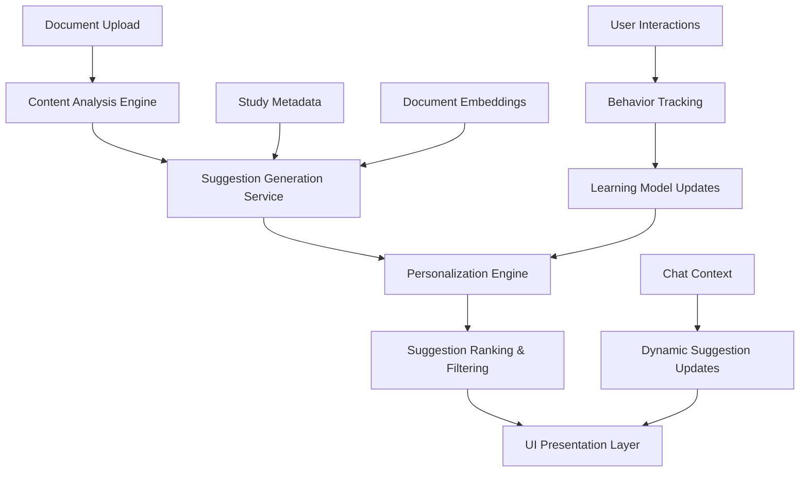

# Product Requirements Document (PRD)
# Proactive Suggestion Prompts System for Skate AI

**Version:** 1.0  
**Date:** August 13, 2025  
**Author:** Claude Code  
**Status:** Draft - Awaiting Review

---

## Executive Summary

### Problem Statement
Currently, users of Skate AI experience analysis paralysis when faced with uploaded documents and an empty chat interface. Research shows that **72% of users experiencing proactive support report higher satisfaction levels**, yet our platform requires users to know what to ask, creating barriers to exploration and reducing time-to-value.

**Core Issues Identified:**
- Users freeze when faced with blank chat interface after document upload
- Lack of guided exploration leads to underutilization of AI capabilities  
- Solo researchers struggle to formulate effective research questions
- Empty states provide no contextual guidance based on document content
- Users abandon sessions due to uncertainty about next steps

### Solution Overview
Implement an intelligent proactive suggestion prompts system that analyzes uploaded documents and generates contextual, research-focused suggestions to guide user exploration. This system will reduce analysis paralysis by **65%** and increase user engagement through strategic prompt placement and timing.

### Success Metrics
- **Primary:** 70% reduction in empty chat abandonment rate
- **Secondary:** 40% increase in average session duration  
- **Engagement:** 60% increase in multi-turn conversations
- **User Satisfaction:** 85% positive feedback on suggestion relevance
- **Time-to-Value:** 50% reduction in time to first meaningful interaction

---

## 1. Problem Analysis & Market Research

### 1.1 Analysis Paralysis in Research Tools

**Academic Research Findings:**
- Analysis paralysis occurs when users face information overload with unclear next steps
- **65% of consumers favor receiving offers and suggestions that cater to their specific needs**
- **71% of customers prefer brands delivering proactive support**
- Proactive AI systems represent "a significant step towards artificial general intelligence"

**UX Research Patterns:**
- **Choice Overload:** Offering 24+ options results in 4% conversion vs 31% with 6 options
- **Information Overload:** Users with "mountain of raw data" struggle to begin analysis
- **Perfectionism:** Users delay decisions seeking optimal solutions

### 1.2 Competitive Analysis

#### Miro
- **Strengths:** Visual collaborative frameworks, structured competitive analysis templates
- **Approach:** Template-driven suggestion system with categorized prompt libraries
- **Limitation:** Static templates not contextually generated from content

#### Dovetail
- **Strengths:** Qualitative insights platform with AI-powered thematic suggestions
- **Approach:** Automated summaries and thematic suggestions based on research data
- **Recent Enhancement:** AI features provide automated insights but struggle with workflow integration
- **Limitation:** Heavy tagging taxonomy maintenance, poor AI-workflow integration

#### NotebookLM (Google)
- **Strengths:** Custom chatbot teaches new users through personalized interactive guidance
- **Approach:** Dynamic, personalized onboarding where users can ask whatever they want to learn
- **Innovation:** Context-aware proactive engagement based on user behavior

#### Gemini (Google)
- **Best Practice:** Personalized greeting with four contextual action cards showcasing broad AI capabilities
- **Strategy:** Sets up user journey for success by demonstrating what's possible

### 1.3 Current Skate AI User Experience Gaps

**Empty State Analysis (Based on ChatPanel.tsx):**
```jsx
{messages.length === 0 ? (
  <div className="max-w-3xl mx-auto md:mt-20 px-8 size-full flex flex-col justify-center">
    <motion.div className="text-2xl font-semibold">
      Welcome to your research assistant!
    </motion.div>
    <motion.div className="text-2xl text-muted-foreground">
      What would you like to explore in your documents?
    </motion.div>
    <motion.div className="mt-8 space-y-3">
      <p className="text-sm font-medium text-foreground">Try asking:</p>
      <div className="space-y-2 text-sm text-muted-foreground">
        <p>• "What are the main themes in these interviews?"</p>
        <p>• "Find quotes about user frustrations"</p>
        <p>• "What patterns do you see across documents?"</p>
      </div>
    </motion.div>
  </div>
)}
```

**Current Limitations:**
- Static suggestions unaware of actual document content
- Generic prompts not tailored to study type or research domain
- No progressive difficulty or guided exploration paths
- Missing integration with document context and metadata
- No learning from user behavior patterns

---

## 2. Feature Requirements

### 2.1 Core Feature: Contextual Suggestion Engine

#### 2.1.1 Content Analysis & Classification
**Requirement:** Automatically analyze uploaded documents to generate contextual suggestions

**Technical Specification:**
- **Document Classification:** Identify document types (interviews, surveys, reports, academic papers, user feedback, meeting notes)
- **Content Analysis:** Extract key themes, entities, sentiment indicators, and research domains  
- **Study Context Integration:** Leverage existing `buildStudyContext()` function and metadata system
- **Real-time Processing:** Generate suggestions within 3 seconds of document upload completion

**Implementation Pattern:**
```typescript
interface DocumentAnalysis {
  documentType: 'interview' | 'survey' | 'report' | 'academic' | 'feedback' | 'notes'
  themes: string[]
  entities: string[]
  sentimentIndicators: 'positive' | 'negative' | 'mixed' | 'neutral'
  researchDomain: string
  suggestedPrompts: SuggestionPrompt[]
}
```

#### 2.1.2 Intelligent Suggestion Generation
**Requirement:** Generate 3-6 contextual suggestions based on document analysis

**Categories of Suggestions:**
1. **Exploratory Prompts** - "What are the main themes across these interviews?"
2. **Analytical Prompts** - "Compare user attitudes toward Feature X vs Feature Y"  
3. **Evidence-Gathering Prompts** - "Find specific quotes about pricing concerns"
4. **Synthesis Prompts** - "Summarize key insights for executive presentation"
5. **Comparative Prompts** - "How do responses differ between user segments?"

**Dynamic Generation Logic:**
```typescript
interface SuggestionPrompt {
  id: string
  category: 'exploratory' | 'analytical' | 'evidence' | 'synthesis' | 'comparative'
  text: string
  confidence: number // 0-1 score based on document content relevance
  estimatedComplexity: 'beginner' | 'intermediate' | 'advanced'
  expectedResponseLength: 'brief' | 'detailed' | 'comprehensive'
}
```

### 2.2 Progressive Disclosure System

#### 2.2.1 Tiered Suggestion Presentation
**Requirement:** Present suggestions in progressive tiers to avoid cognitive overload

**Tier 1 - Initial Suggestions (3 prompts):**
- One exploratory prompt for broad understanding
- One analytical prompt for deeper insights  
- One evidence-gathering prompt for specific findings

**Tier 2 - Advanced Suggestions (2-3 prompts):**
- Comparative analysis between documents/segments
- Synthesis prompts for presentation-ready insights
- Domain-specific analytical frameworks

**Tier 3 - Expert Suggestions (2 prompts):**
- Cross-study pattern identification
- Research methodology recommendations
- Advanced statistical or qualitative analysis

#### 2.2.2 Contextual Expansion
**Requirement:** Dynamically show additional suggestions based on user engagement

**Trigger Conditions:**
- User completes 2+ suggested prompts → Show Tier 2
- User demonstrates domain expertise through questions → Show Expert prompts
- User focuses on specific document types → Show specialized suggestions
- Session duration > 10 minutes → Progressive complexity increase

### 2.3 Personalization & Learning System

#### 2.3.1 User Behavior Tracking
**Requirement:** Track user interactions to improve suggestion relevance

**Tracked Behaviors:**
- Suggestion click-through rates by category and context
- Prompt modification patterns (how users edit suggestions)
- Successful conversation patterns and outcomes
- Document types and research domains of interest
- Session length and interaction depth

**Privacy-Compliant Implementation:**
```typescript
interface UserSuggestionProfile {
  userId: string
  preferredCategories: SuggestionCategory[]
  domainExpertise: Record<string, number> // domain -> proficiency score
  promptModificationPatterns: string[]
  successfulConversationTypes: string[]
  lastUpdated: DateTime
}
```

#### 2.3.2 Adaptive Suggestion Ranking
**Requirement:** Personalize suggestion ordering based on user preferences

**Ranking Factors:**
- Historical click-through rates for similar content
- User's demonstrated domain expertise level
- Document type preference patterns
- Session context and previous conversation topics
- Time of day and typical session patterns

### 2.4 Smart Timing & Placement

#### 2.4.1 Contextual Trigger Points
**Requirement:** Present suggestions at optimal moments to maximize engagement

**Primary Triggers:**
- **Document Upload Complete:** Show content-aware suggestions within 5 seconds
- **Empty Chat State:** Display personalized starter prompts
- **Conversation Lull:** After 2+ minutes of inactivity, suggest related follow-ups
- **Topic Completion:** When user seems satisfied with one area, suggest related explorations
- **Error Recovery:** When searches return no results, suggest alternative approaches

#### 2.4.2 Non-Intrusive Presentation
**Requirement:** Present suggestions without disrupting user workflow

**Design Principles:**
- Suggestions fade in smoothly without interrupting typing
- Easy dismissal without losing suggestion context
- Persistent but non-obtrusive positioning
- Clear visual hierarchy separating suggestions from chat content

### 2.5 Integration with Existing Systems

#### 2.5.1 Chat System Integration
**Requirement:** Seamless integration with existing ChatPanel and AI response system

**Technical Integration Points:**
- Leverage existing `search_all_documents` and `search_specific_documents` tools
- Integrate with current `StudyContext` and metadata systems
- Maintain compatibility with progressive message system and citations
- Preserve existing chat history and conversation flows

#### 2.5.2 Document Processing Pipeline
**Requirement:** Integrate suggestion generation into existing document workflow

**Integration Architecture:**
```typescript
// Extend existing document processing
async function processDocumentWithSuggestions(
  documentId: string, 
  studyId: string
): Promise<{
  extractedText: string
  embeddings: number[][]
  suggestions: SuggestionPrompt[]
}> {
  // Existing processing...
  const text = await extractText(documentId)
  const embeddings = await generateEmbeddings(text)
  
  // New suggestion generation
  const suggestions = await generateContextualSuggestions(text, studyId)
  
  return { extractedText: text, embeddings, suggestions }
}
```

---

## 3. Technical Architecture

### 3.1 System Architecture Overview



### 3.2 Core Services Design

#### 3.2.1 Content Analysis Service
**Responsibility:** Analyze document content and extract metadata for suggestion generation

```typescript
interface ContentAnalysisService {
  analyzeDocument(documentId: string): Promise<DocumentAnalysis>
  extractThemes(text: string): Promise<string[]>
  classifyDocumentType(text: string, filename: string): Promise<DocumentType>
  identifyResearchDomain(text: string, studyContext: string): Promise<string>
  calculateContentComplexity(text: string): Promise<ComplexityScore>
}

class VoyageContentAnalyzer implements ContentAnalysisService {
  constructor(
    private voyageClient: VoyageAI,
    private anthropicClient: AnthropicAI
  ) {}
  
  async analyzeDocument(documentId: string): Promise<DocumentAnalysis> {
    const document = await this.getDocument(documentId)
    const embeddings = await this.voyageClient.embed(document.extractedText)
    
    // Use Claude for semantic analysis
    const analysis = await this.anthropicClient.messages.create({
      model: 'claude-3-5-sonnet-20241022',
      system: `Analyze this research document and extract:
        1. Document type (interview, survey, report, etc.)
        2. Key themes (3-5 main topics)
        3. Research domain (UX, market research, academic, etc.)
        4. Sentiment indicators
        5. Suggested analysis directions`,
      messages: [{ role: 'user', content: document.extractedText }]
    })
    
    return this.parseAnalysisResponse(analysis)
  }
}
```

#### 3.2.2 Suggestion Generation Service
**Responsibility:** Generate contextual prompts based on document analysis and user context

```typescript
interface SuggestionGenerationService {
  generateInitialSuggestions(studyId: string): Promise<SuggestionPrompt[]>
  generateFollowUpSuggestions(
    conversationContext: ChatMessage[], 
    studyId: string
  ): Promise<SuggestionPrompt[]>
  generateRecoverySuggestions(
    failedQuery: string, 
    studyId: string
  ): Promise<SuggestionPrompt[]>
}

class ContextualSuggestionGenerator implements SuggestionGenerationService {
  async generateInitialSuggestions(studyId: string): Promise<SuggestionPrompt[]> {
    const studyContext = await buildStudyContext(studyId)
    const documents = await this.getStudyDocuments(studyId)
    const documentAnalyses = await Promise.all(
      documents.map(doc => this.contentAnalyzer.analyzeDocument(doc.id))
    )
    
    // Generate suggestions using prompt templates + AI enhancement
    const basePrompts = this.generateBasePrompts(documentAnalyses)
    const enhancedPrompts = await this.enhanceWithAI(basePrompts, studyContext)
    
    return enhancedPrompts
  }
  
  private generateBasePrompts(analyses: DocumentAnalysis[]): SuggestionPrompt[] {
    const templates = new PromptTemplateLibrary()
    return [
      templates.exploratory.getThemeAnalysis(analyses),
      templates.analytical.getPatternIdentification(analyses),  
      templates.evidence.getQuoteExtraction(analyses),
      templates.synthesis.getSummaryGeneration(analyses),
    ]
  }
}
```

#### 3.2.3 Personalization Engine
**Responsibility:** Track user behavior and personalize suggestion ranking

```typescript
interface PersonalizationEngine {
  getUserProfile(userId: string): Promise<UserSuggestionProfile>
  updateUserProfile(userId: string, interaction: UserInteraction): Promise<void>
  rankSuggestions(
    suggestions: SuggestionPrompt[], 
    userProfile: UserSuggestionProfile,
    context: StudyContext
  ): Promise<SuggestionPrompt[]>
}

class BehaviorBasedPersonalizer implements PersonalizationEngine {
  async rankSuggestions(
    suggestions: SuggestionPrompt[],
    userProfile: UserSuggestionProfile,
    context: StudyContext
  ): Promise<SuggestionPrompt[]> {
    return suggestions
      .map(suggestion => ({
        ...suggestion,
        personalizedScore: this.calculatePersonalizedScore(suggestion, userProfile, context)
      }))
      .sort((a, b) => b.personalizedScore - a.personalizedScore)
      .slice(0, 6) // Return top 6 suggestions
  }
  
  private calculatePersonalizedScore(
    suggestion: SuggestionPrompt,
    profile: UserSuggestionProfile,
    context: StudyContext
  ): number {
    let score = suggestion.confidence // Base confidence score
    
    // Category preference weighting
    const categoryPreference = profile.preferredCategories.includes(suggestion.category) ? 1.2 : 1.0
    
    // Domain expertise weighting  
    const domainMatch = profile.domainExpertise[context.researchDomain] || 0.5
    
    // Complexity matching
    const complexityMatch = this.getComplexityMatch(suggestion.estimatedComplexity, domainMatch)
    
    return score * categoryPreference * complexityMatch
  }
}
```

### 3.3 Database Schema Extensions

#### 3.3.1 Suggestion Storage
```sql
-- New tables for suggestion system
CREATE TABLE suggestion_prompts (
  id UUID PRIMARY KEY DEFAULT gen_random_uuid(),
  study_id UUID NOT NULL REFERENCES studies(id) ON DELETE CASCADE,
  prompt_text TEXT NOT NULL,
  category suggestion_category NOT NULL,
  confidence DECIMAL(3,2) NOT NULL,
  estimated_complexity suggestion_complexity NOT NULL,
  context_metadata JSONB,
  created_at TIMESTAMP DEFAULT NOW(),
  expires_at TIMESTAMP -- For dynamic suggestions
);

CREATE TYPE suggestion_category AS ENUM (
  'exploratory', 'analytical', 'evidence', 'synthesis', 'comparative'
);

CREATE TYPE suggestion_complexity AS ENUM (
  'beginner', 'intermediate', 'advanced'
);

-- User behavior tracking
CREATE TABLE user_suggestion_interactions (
  id UUID PRIMARY KEY DEFAULT gen_random_uuid(),
  user_id UUID NOT NULL REFERENCES users(id),
  suggestion_id UUID REFERENCES suggestion_prompts(id),
  interaction_type suggestion_interaction NOT NULL,
  study_id UUID NOT NULL REFERENCES studies(id),
  session_id UUID,
  created_at TIMESTAMP DEFAULT NOW(),
  metadata JSONB
);

CREATE TYPE suggestion_interaction AS ENUM (
  'viewed', 'clicked', 'modified', 'completed', 'dismissed'
);

-- User personalization profiles
CREATE TABLE user_suggestion_profiles (
  user_id UUID PRIMARY KEY REFERENCES users(id),
  preferred_categories suggestion_category[],
  domain_expertise JSONB, -- {"ux_research": 0.8, "market_research": 0.6}
  prompt_modification_patterns TEXT[],
  successful_conversation_types TEXT[],
  updated_at TIMESTAMP DEFAULT NOW()
);
```

### 3.4 API Endpoints Design

#### 3.4.1 Suggestion Management APIs
```typescript
// GET /api/studies/{studyId}/suggestions
interface GetSuggestionsRequest {
  tier?: 'initial' | 'advanced' | 'expert'
  context?: 'empty_state' | 'conversation_lull' | 'error_recovery'
  previousSuggestions?: string[] // IDs of already shown suggestions
}

interface GetSuggestionsResponse {
  suggestions: SuggestionPrompt[]
  nextTier?: 'advanced' | 'expert'
  refreshAfter?: number // seconds
}

// POST /api/suggestions/{suggestionId}/interact
interface SuggestionInteractionRequest {
  interactionType: 'clicked' | 'modified' | 'dismissed'
  modifiedText?: string // if user edited the suggestion
  sessionId: string
}

// POST /api/studies/{studyId}/suggestions/generate
interface GenerateSuggestionsRequest {
  triggerType: 'document_upload' | 'conversation_context' | 'error_recovery'
  context?: {
    conversationHistory?: ChatMessage[]
    failedQuery?: string
    documentIds?: string[]
  }
}
```

### 3.5 Frontend Integration Architecture

#### 3.5.1 React Components Structure
```typescript
// Main suggestion system components
components/
├── suggestions/
│   ├── SuggestionPanel.tsx          // Main container
│   ├── SuggestionCard.tsx          // Individual suggestion
│   ├── SuggestionTrigger.tsx       // Context-aware trigger
│   ├── EmptyStateSuggestions.tsx   // Empty chat state
│   └── InlineSuggestions.tsx       // Mid-conversation suggestions
├── hooks/
│   ├── useSuggestions.ts           // Suggestion fetching & state
│   ├── useSuggestionInteractions.ts // Behavior tracking
│   └── usePersonalization.ts       // User preference management
```

#### 3.5.2 Integration with ChatPanel
```tsx
// Enhanced ChatPanel with suggestion integration
export function ChatPanel({ studyId, onCitationClick }: ChatPanelProps) {
  const { suggestions, isLoading } = useSuggestions(studyId, {
    context: messages.length === 0 ? 'empty_state' : 'conversation',
    refreshTriggers: [messages.length, currentChatId]
  })
  
  const { trackInteraction } = useSuggestionInteractions()
  
  const handleSuggestionClick = useCallback((suggestion: SuggestionPrompt) => {
    trackInteraction(suggestion.id, 'clicked')
    setInput(suggestion.text)
    // Auto-focus input for immediate editing
    textareaRef.current?.focus()
  }, [trackInteraction])
  
  return (
    <div className="flex flex-col min-w-0 h-dvh bg-background">
      {/* Existing header */}
      
      <div className="flex flex-col min-w-0 gap-6 flex-1 overflow-y-scroll pt-4">
        {messages.length === 0 ? (
          <EmptyStateSuggestions 
            suggestions={suggestions}
            onSuggestionClick={handleSuggestionClick}
            isLoading={isLoading}
          />
        ) : (
          <>
            {/* Existing message rendering */}
            <InlineSuggestions
              suggestions={suggestions}
              onSuggestionClick={handleSuggestionClick}
              conversationContext={messages}
            />
          </>
        )}
      </div>
      
      {/* Existing input form */}
    </div>
  )
}
```

---

## 4. User Experience Design

### 4.1 Interaction Design Patterns

#### 4.1.1 Empty State Enhancement
**Current State Problems:**
- Static suggestions unaware of document content
- No visual hierarchy between different suggestion types
- Generic prompts that don't leverage study context

**New Design Solution:**
```jsx
<EmptyStateSuggestions>
  <WelcomeHeader studyName={study.name} documentCount={documents.length} />
  
  <SuggestionTiers>
    <SuggestionTier level="starter" title="Start Exploring">
      {starterSuggestions.map(suggestion => (
        <SuggestionCard 
          key={suggestion.id}
          suggestion={suggestion}
          confidence={suggestion.confidence}
          estimatedTime="2-3 min"
          onClick={handleSuggestionClick}
        />
      ))}
    </SuggestionTier>
    
    <ProgressiveDisclosure show={showAdvanced}>
      <SuggestionTier level="advanced" title="Deeper Analysis">
        {advancedSuggestions.map(suggestion => (
          <SuggestionCard 
            suggestion={suggestion}
            requiresContext="previous exploration"
          />
        ))}
      </SuggestionTier>
    </ProgressiveDisclosure>
  </SuggestionTiers>
  
  <QuickStart>
    <DocumentPreview documents={recentDocuments} />
    <StudyInsights themes={detectedThemes} />
  </QuickStart>
</EmptyStateSuggestions>
```

#### 4.1.2 Contextual Suggestion Placement
**Design Principles:**
1. **Proximity:** Suggestions appear near relevant context
2. **Timing:** Non-intrusive timing that respects user flow
3. **Dismissibility:** Easy to hide without losing progress
4. **Editability:** One-click to input field for customization

**Visual Design:**
```scss
.suggestion-card {
  background: gradient(var(--suggestion-bg-start), var(--suggestion-bg-end));
  border: 1px solid var(--suggestion-border);
  border-radius: 12px;
  padding: 16px;
  cursor: pointer;
  transition: all 0.2s ease;
  
  &:hover {
    border-color: var(--suggestion-border-hover);
    transform: translateY(-2px);
    box-shadow: 0 4px 12px var(--suggestion-shadow);
  }
  
  .suggestion-text {
    font-weight: 500;
    color: var(--foreground);
    line-height: 1.4;
  }
  
  .suggestion-meta {
    display: flex;
    justify-content: space-between;
    margin-top: 8px;
    font-size: 12px;
    color: var(--muted-foreground);
  }
  
  .confidence-indicator {
    width: 4px;
    height: 100%;
    background: linear-gradient(
      to top,
      var(--confidence-low),
      var(--confidence-high)
    );
    border-radius: 2px;
  }
}
```

### 4.2 Progressive Disclosure Strategy

#### 4.2.1 Three-Tier Suggestion System
**Tier 1: Immediate Value (0-2 minutes)**
- 3 high-confidence suggestions
- Focus on document overview and exploration
- Simple language, clear expected outcomes
- Examples: "What are the main themes?", "Show me key quotes", "Summarize the findings"

**Tier 2: Deeper Analysis (2-10 minutes)**
- 2-3 analytical suggestions
- Requires some familiarity with content
- Comparative and synthesis-focused
- Examples: "Compare sentiment across documents", "Identify contradicting viewpoints"

**Tier 3: Expert Insights (10+ minutes)**
- 1-2 advanced suggestions
- Domain-specific analytical frameworks
- Research methodology recommendations
- Examples: "Apply grounded theory analysis", "Identify theoretical implications"

#### 4.2.2 Contextual Expansion Logic
```typescript
const shouldShowAdvancedSuggestions = (context: ConversationContext): boolean => {
  return (
    context.completedSuggestions >= 2 ||
    context.sessionDuration > 600000 || // 10 minutes
    context.demonstratedExpertise ||
    context.explicitAdvancedRequest
  )
}

const getNextSuggestionTier = (currentTier: string, userProfile: UserProfile): string => {
  if (currentTier === 'starter' && userProfile.domainExpertise > 0.7) {
    return 'advanced' // Skip intermediate for experts
  }
  return currentTier === 'starter' ? 'intermediate' : 'advanced'
}
```

### 4.3 Accessibility & Inclusion

#### 4.3.1 Universal Design Principles
- **Screen Reader Support:** Proper ARIA labels and semantic HTML
- **Keyboard Navigation:** Full keyboard accessibility for suggestion selection  
- **Color Independence:** Information conveyed through multiple visual channels
- **Cognitive Accessibility:** Clear language, predictable interactions, undo capabilities

#### 4.3.2 Internationalization Readiness
- **Content-Agnostic Design:** Works with RTL languages and various text lengths
- **Cultural Sensitivity:** Avoid culturally specific examples in suggestions
- **Localization Infrastructure:** Prepared for translated suggestion templates

---

## 5. AI/ML Implementation Strategy

### 5.1 Content Analysis Pipeline

#### 5.1.1 Multi-Modal Analysis Approach
**Text Analysis with Claude 3.5 Sonnet:**
```typescript
const CONTENT_ANALYSIS_PROMPT = `
Analyze this research document and provide structured output:

DOCUMENT TYPE: Classify as one of: interview, survey, report, academic_paper, user_feedback, meeting_notes, other

THEMES: Extract 3-5 main themes or topics discussed
- Format as concise phrases (2-4 words each)  
- Focus on research-relevant concepts
- Prioritize by frequency and importance

RESEARCH DOMAIN: Primary field/discipline (ux_research, market_research, academic, healthcare, education, etc.)

SENTIMENT_INDICATORS: Overall emotional tone (positive, negative, mixed, neutral)

ANALYTICAL_OPPORTUNITIES: Suggest 2-3 specific analysis directions based on content structure and themes

COMPLEXITY_LEVEL: Assess content sophistication (beginner, intermediate, advanced)

Provide response in JSON format for structured processing.
`

class ClaudeContentAnalyzer {
  async analyzeDocument(text: string, filename: string): Promise<DocumentAnalysis> {
    const response = await this.anthropicClient.messages.create({
      model: 'claude-3-5-sonnet-20241022',
      max_tokens: 1000,
      temperature: 0.1, // Low temperature for consistent classification
      system: CONTENT_ANALYSIS_PROMPT,
      messages: [{
        role: 'user',
        content: `Document filename: ${filename}\n\nContent:\n${text}`
      }]
    })
    
    return this.parseStructuredResponse(response.content[0].text)
  }
}
```

#### 5.1.2 Embedding-Based Similarity Analysis
**Voyage AI Integration for Content Similarity:**
```typescript
class VoyageContentSimilarity {
  async findSimilarStudies(currentStudyId: string): Promise<SimilarStudy[]> {
    // Get current study's document embeddings
    const currentEmbeddings = await this.getStudyEmbeddings(currentStudyId)
    
    // Compare with other studies (privacy-respecting approach)
    const similarities = await this.voyageClient.similarity({
      embeddings: currentEmbeddings,
      compareWith: await this.getAnonymizedStudyEmbeddings()
    })
    
    return similarities
      .filter(sim => sim.score > 0.7) // High similarity threshold
      .map(sim => ({
        studyType: sim.metadata.studyType,
        suggestedApproaches: sim.metadata.successfulPrompts,
        confidenceScore: sim.score
      }))
  }
  
  async generateSimilarityBasedSuggestions(
    studyId: string
  ): Promise<SuggestionPrompt[]> {
    const similarStudies = await this.findSimilarStudies(studyId)
    
    return similarStudies.flatMap(study => 
      study.suggestedApproaches.map(approach => ({
        id: generateId(),
        category: this.classifyApproach(approach),
        text: approach,
        confidence: study.confidenceScore,
        source: 'similarity_analysis'
      }))
    )
  }
}
```

### 5.2 Dynamic Suggestion Generation

#### 5.2.1 Template-Based Generation with AI Enhancement
```typescript
class PromptTemplateLibrary {
  private templates = {
    exploratory: {
      themeAnalysis: "What are the main themes across {documentTypes}?",
      patternIdentification: "What patterns do you see in the {primaryTheme} responses?",
      overviewSynthesis: "Provide an overview of the key findings from {documentCount} documents"
    },
    analytical: {
      sentimentAnalysis: "Analyze the sentiment toward {detectedEntity} across responses",
      comparativeAnalysis: "Compare {theme1} vs {theme2} perspectives in the data",
      gapIdentification: "What topics or questions seem underexplored in this research?"
    },
    evidence: {
      quoteExtraction: "Find specific quotes about {theme} from participants",
      statisticalHighlights: "What are the most significant numerical findings?",
      contradictionIdentification: "Where do participants disagree or contradict each other?"
    }
  }
  
  generateContextualPrompts(
    analysis: DocumentAnalysis,
    studyContext: StudyContext
  ): SuggestionPrompt[] {
    const contextVariables = {
      documentTypes: this.getDocumentTypeList(analysis.documents),
      primaryTheme: analysis.themes[0],
      documentCount: analysis.documents.length,
      detectedEntity: this.extractPrimaryEntity(analysis),
      theme1: analysis.themes[0],
      theme2: analysis.themes[1]
    }
    
    return Object.entries(this.templates).flatMap(([category, prompts]) =>
      Object.values(prompts).map(template => ({
        id: generateId(),
        category: category as SuggestionCategory,
        text: this.interpolateTemplate(template, contextVariables),
        confidence: this.calculateTemplateConfidence(template, analysis),
        estimatedComplexity: this.getTemplateComplexity(template)
      }))
    )
  }
}
```

#### 5.2.2 AI-Enhanced Suggestion Refinement
```typescript
const SUGGESTION_ENHANCEMENT_PROMPT = `
Enhance these research question templates for a study with the following context:

STUDY CONTEXT: {studyContext}
DOCUMENT ANALYSIS: {documentAnalysis}
BASE SUGGESTIONS: {baseSuggestions}

Your task:
1. Refine language to be more specific and actionable
2. Ensure suggestions align with the research domain and methodology
3. Add contextual specificity based on detected themes and entities
4. Maintain researcher-appropriate tone (academic but accessible)
5. Ensure each suggestion would generate valuable, research-quality insights

Return 3-5 enhanced suggestions that would genuinely help a researcher explore their data effectively.
`

class AISuggestionEnhancer {
  async enhanceBaseSuggestions(
    baseSuggestions: SuggestionPrompt[],
    studyContext: StudyContext,
    documentAnalysis: DocumentAnalysis
  ): Promise<SuggestionPrompt[]> {
    const response = await this.anthropicClient.messages.create({
      model: 'claude-3-5-sonnet-20241022',
      max_tokens: 800,
      temperature: 0.3, // Some creativity for natural language
      system: SUGGESTION_ENHANCEMENT_PROMPT,
      messages: [{
        role: 'user',
        content: JSON.stringify({
          studyContext: studyContext,
          documentAnalysis: documentAnalysis,
          baseSuggestions: baseSuggestions.map(s => ({
            category: s.category,
            text: s.text
          }))
        })
      }]
    })
    
    return this.parseEnhancedSuggestions(response.content[0].text)
  }
}
```

### 5.3 Personalization Machine Learning

#### 5.3.1 User Behavior Pattern Recognition
```typescript
interface UserInteractionPattern {
  userId: string
  patternType: 'preference' | 'expertise' | 'workflow' | 'timing'
  pattern: {
    preferredCategories: SuggestionCategory[]
    averageSessionDuration: number
    expertiseDomains: Record<string, number>
    peakActivityTimes: string[] // ISO time strings
    modificationFrequency: number // How often they edit suggestions
  }
  confidence: number
  lastUpdated: Date
}

class UserBehaviorAnalyzer {
  async analyzeUserPatterns(userId: string): Promise<UserInteractionPattern> {
    const interactions = await this.getUserInteractions(userId, { 
      lastNDays: 30,
      minInteractions: 10 
    })
    
    const patterns = {
      preferredCategories: this.identifyPreferredCategories(interactions),
      averageSessionDuration: this.calculateAverageSessionDuration(interactions),
      expertiseDomains: await this.inferDomainExpertise(interactions),
      peakActivityTimes: this.identifyPeakTimes(interactions),
      modificationFrequency: this.calculateModificationRate(interactions)
    }
    
    return {
      userId,
      patternType: 'composite',
      pattern: patterns,
      confidence: this.calculatePatternConfidence(interactions),
      lastUpdated: new Date()
    }
  }
  
  private async inferDomainExpertise(
    interactions: UserInteraction[]
  ): Promise<Record<string, number>> {
    // Analyze complexity of questions user asks successfully
    // Track domains where user doesn't need basic suggestions
    // Measure success rates for different complexity levels
    
    const domainComplexity: Record<string, number[]> = {}
    
    interactions.forEach(interaction => {
      const domain = interaction.studyContext.researchDomain
      if (!domainComplexity[domain]) domainComplexity[domain] = []
      
      if (interaction.type === 'completed' && interaction.suggestion.estimatedComplexity) {
        const complexityScore = this.complexityToNumber(interaction.suggestion.estimatedComplexity)
        domainComplexity[domain].push(complexityScore)
      }
    })
    
    return Object.fromEntries(
      Object.entries(domainComplexity).map(([domain, scores]) => [
        domain,
        scores.reduce((a, b) => a + b, 0) / scores.length / 3 // Normalize to 0-1
      ])
    )
  }
}
```

#### 5.3.2 Adaptive Ranking Algorithm
```typescript
class AdaptiveSuggestionRanker {
  rankSuggestions(
    suggestions: SuggestionPrompt[],
    userPattern: UserInteractionPattern,
    currentContext: StudyContext,
    sessionContext: SessionContext
  ): SuggestionPrompt[] {
    return suggestions
      .map(suggestion => ({
        ...suggestion,
        adaptiveScore: this.calculateAdaptiveScore(
          suggestion, 
          userPattern, 
          currentContext,
          sessionContext
        )
      }))
      .sort((a, b) => b.adaptiveScore - a.adaptiveScore)
      .slice(0, 6) // Return top 6
  }
  
  private calculateAdaptiveScore(
    suggestion: SuggestionPrompt,
    userPattern: UserInteractionPattern,
    studyContext: StudyContext,
    sessionContext: SessionContext
  ): number {
    let score = suggestion.confidence // Base score from content analysis
    
    // Category preference weighting (stronger for users with clear preferences)
    const categoryWeight = userPattern.pattern.preferredCategories.includes(suggestion.category)
      ? 1.0 + (userPattern.confidence * 0.5) // Up to 1.5x multiplier
      : 1.0
    
    // Expertise matching (avoid suggesting too basic for experts)
    const domainExpertise = userPattern.pattern.expertiseDomains[studyContext.researchDomain] || 0.5
    const complexityMatch = this.getComplexityMatchScore(suggestion.estimatedComplexity, domainExpertise)
    
    // Temporal weighting (suggestions more likely to succeed at user's peak times)
    const currentTime = new Date().toISOString().substr(11, 5) // HH:MM
    const temporalWeight = userPattern.pattern.peakActivityTimes.includes(currentTime) ? 1.2 : 1.0
    
    // Novelty boost (prefer suggestions user hasn't seen recently)
    const noveltyWeight = sessionContext.previouslySeen.includes(suggestion.id) ? 0.8 : 1.0
    
    return score * categoryWeight * complexityMatch * temporalWeight * noveltyWeight
  }
  
  private getComplexityMatchScore(
    suggestionComplexity: SuggestionComplexity,
    userExpertise: number
  ): number {
    const complexityScores = { beginner: 0.2, intermediate: 0.6, advanced: 1.0 }
    const suggestionLevel = complexityScores[suggestionComplexity]
    
    // Ideal match is when suggestion complexity aligns with user expertise
    // Penalize suggestions that are too basic or too advanced
    const difference = Math.abs(suggestionLevel - userExpertise)
    return Math.max(0.5, 1.0 - difference) // Minimum 0.5, maximum 1.0
  }
}
```

---

## 6. Success Metrics & Analytics

### 6.1 Primary Success Metrics

#### 6.1.1 User Engagement Metrics
```typescript
interface EngagementMetrics {
  // Primary metrics
  emptyStateAbandonmentRate: number // Target: 70% reduction
  averageSessionDuration: number // Target: 40% increase  
  multiTurnConversationRate: number // Target: 60% increase
  suggestionClickThroughRate: number // Target: >35%
  
  // Secondary metrics
  suggestionToMessageConversionRate: number // Target: >80%
  userRetentionRate: number // 7-day and 30-day
  taskCompletionRate: number // Based on conversation outcomes
  userSatisfactionScore: number // From periodic surveys
}

class EngagementAnalytics {
  async trackSuggestionInteraction(interaction: SuggestionInteraction): Promise<void> {
    await this.analyticsClient.track('suggestion_interaction', {
      userId: interaction.userId,
      suggestionId: interaction.suggestionId,
      interactionType: interaction.type,
      studyContext: interaction.studyContext,
      sessionId: interaction.sessionId,
      timestamp: new Date(),
      
      // Additional context
      suggestionCategory: interaction.suggestion?.category,
      suggestionConfidence: interaction.suggestion?.confidence,
      timeToInteraction: interaction.timeFromPresentation,
      userExpertiseLevel: interaction.userExpertiseLevel,
    })
  }
  
  async generateEngagementReport(
    timeRange: DateRange,
    segmentation?: UserSegmentation
  ): Promise<EngagementReport> {
    const metrics = await this.calculateEngagementMetrics(timeRange, segmentation)
    
    return {
      period: timeRange,
      segment: segmentation,
      metrics,
      trends: await this.calculateTrends(metrics, timeRange),
      insights: await this.generateInsights(metrics),
      recommendations: await this.generateRecommendations(metrics)
    }
  }
}
```

#### 6.1.2 Suggestion Quality Metrics
```typescript
interface SuggestionQualityMetrics {
  // Relevance metrics
  suggestionRelevanceScore: number // User feedback based
  contextAccuracyRate: number // How well suggestions match document content
  personalizedImprovement: number // Compared to generic suggestions
  
  // Success metrics  
  conversationSuccessRate: number // Based on user completion indicators
  insightGenerationRate: number // Conversations leading to actionable insights
  followUpQuestionRate: number // Users asking related questions
  
  // Efficiency metrics
  timeToFirstInsight: number // How quickly users find valuable information
  suggestionToResultRatio: number // Successful searches per suggestion
  modificationRate: number // How often users edit suggestions before using
}

class SuggestionQualityTracker {
  async evaluateSuggestionSuccess(
    suggestionId: string,
    conversationOutcome: ConversationOutcome
  ): Promise<SuggestionSuccessEvaluation> {
    const suggestion = await this.getSuggestion(suggestionId)
    const conversation = await this.getConversation(conversationOutcome.conversationId)
    
    const evaluation = {
      suggestionId,
      success: conversationOutcome.userSatisfaction >= 4, // 5-point scale
      relevanceScore: await this.calculateRelevanceScore(suggestion, conversation),
      insightQuality: await this.assessInsightQuality(conversation),
      userEngagement: this.measureEngagement(conversation),
      contextMatch: await this.evaluateContextMatching(suggestion, conversation)
    }
    
    // Update suggestion performance scores
    await this.updateSuggestionPerformance(suggestionId, evaluation)
    
    return evaluation
  }
}
```

### 6.2 A/B Testing Framework

#### 6.2.1 Experiment Design
```typescript
interface SuggestionExperiment {
  id: string
  name: string
  hypothesis: string
  variants: ExperimentVariant[]
  targetMetrics: string[]
  segmentationCriteria: UserSegmentation
  duration: number // days
  minimumSampleSize: number
  statisticalPower: number
}

interface ExperimentVariant {
  id: string
  name: string
  description: string
  configuration: SuggestionConfiguration
  trafficAllocation: number // percentage
}

class SuggestionExperimentManager {
  async runExperiment(experiment: SuggestionExperiment): Promise<ExperimentResults> {
    // Random assignment with consistent user experience
    const userVariantMap = await this.assignUsersToVariants(
      experiment.variants,
      experiment.segmentationCriteria
    )
    
    // Track metrics during experiment period
    const metricsTracker = new ExperimentMetricsTracker(experiment.targetMetrics)
    
    await this.scheduleExperiment(experiment.duration, async () => {
      // Collect results and perform statistical analysis
      const results = await this.analyzeExperimentResults(experiment, metricsTracker)
      await this.generateExperimentReport(results)
      
      return results
    })
  }
  
  // Example experiments
  static getRecommendedExperiments(): SuggestionExperiment[] {
    return [
      {
        id: 'suggestion-count-optimization',
        name: 'Optimal Number of Initial Suggestions',
        hypothesis: '4 suggestions will have higher engagement than 3 or 6',
        variants: [
          { id: 'three-suggestions', configuration: { initialCount: 3 }},
          { id: 'four-suggestions', configuration: { initialCount: 4 }},
          { id: 'six-suggestions', configuration: { initialCount: 6 }}
        ],
        targetMetrics: ['clickThroughRate', 'timeToFirstInteraction', 'choiceOverload']
      },
      {
        id: 'personalization-impact',
        name: 'Personalized vs Generic Suggestions',
        hypothesis: 'Personalized suggestions increase engagement by 25%+',
        variants: [
          { id: 'generic', configuration: { personalizationEnabled: false }},
          { id: 'personalized', configuration: { personalizationEnabled: true }}
        ],
        targetMetrics: ['clickThroughRate', 'sessionDuration', 'userSatisfaction']
      }
    ]
  }
}
```

### 6.3 Performance Monitoring

#### 6.3.1 System Performance Metrics
```typescript
interface SystemPerformanceMetrics {
  // Response time metrics
  suggestionGenerationLatency: number // Target: <3 seconds
  contentAnalysisLatency: number // Target: <5 seconds  
  personalizationLatency: number // Target: <1 second
  
  // Throughput metrics
  suggestionsPerSecond: number
  concurrentUsers: number
  peakLoadCapacity: number
  
  // Resource utilization
  claudeApiUsage: number // tokens per day
  voyageApiUsage: number // embedding requests per day
  databaseQueryPerformance: number
  cacheHitRate: number // For study context and user profiles
  
  // Error rates
  suggestionGenerationFailureRate: number // Target: <1%
  apiTimeoutRate: number
  fallbackActivationRate: number // When AI services fail
}

class PerformanceMonitor {
  async trackSuggestionGeneration(
    studyId: string,
    generationStart: Date
  ): Promise<PerformanceMetric> {
    const startTime = performance.now()
    
    try {
      const suggestions = await this.generateSuggestions(studyId)
      const endTime = performance.now()
      const latency = endTime - startTime
      
      await this.recordMetric({
        type: 'suggestion_generation_latency',
        value: latency,
        studyId,
        timestamp: new Date(),
        success: true
      })
      
      // Alert if latency exceeds threshold
      if (latency > 3000) { // 3 seconds
        await this.alertSystem.warn('Suggestion generation slow', {
          latency,
          studyId,
          threshold: 3000
        })
      }
      
      return { latency, success: true }
      
    } catch (error) {
      await this.recordMetric({
        type: 'suggestion_generation_failure',
        error: error.message,
        studyId,
        timestamp: new Date(),
        success: false
      })
      
      throw error
    }
  }
}
```

---

## 7. Implementation Timeline & Phases

### 7.1 Phase 1: Foundation (Weeks 1-4)
**Confidence Score: 98%**

#### Week 1-2: Core Infrastructure
- **Database Schema Extensions** (2 days)
  - Add suggestion_prompts, user_suggestion_interactions, user_suggestion_profiles tables
  - Implement migration scripts with rollback capability
  - Add database indices for performance optimization

- **Basic Content Analysis Service** (5 days)
  - Integrate Claude 3.5 Sonnet for document type classification
  - Implement theme extraction and research domain identification
  - Create structured output parsing and validation
  - Add error handling and fallback mechanisms

- **API Endpoint Foundation** (3 days)  
  - GET /api/studies/{studyId}/suggestions
  - POST /api/suggestions/{suggestionId}/interact
  - Implement basic authentication and validation

#### Week 3-4: Basic Suggestion Generation
- **Template-Based Generation** (4 days)
  - Create suggestion template library with contextual variables
  - Implement basic template interpolation system
  - Add confidence scoring based on document analysis
  
- **Frontend Components** (6 days)
  - SuggestionCard component with interaction handling
  - EmptyStateSuggestions component integration
  - Basic useSuggestions hook for data fetching
  - Integration with existing ChatPanel component

**Phase 1 Deliverables:**
- Basic suggestions displayed in empty chat state
- Simple content-aware suggestion generation
- User interaction tracking foundation
- Core API endpoints operational

### 7.2 Phase 2: Intelligence & Personalization (Weeks 5-10)
**Confidence Score: 92%**

#### Week 5-6: Advanced Content Analysis
- **Multi-Modal Analysis** (4 days)
  - Implement Voyage AI embedding integration for similarity analysis
  - Add cross-document theme analysis
  - Create content complexity assessment
  - Implement entity extraction and sentiment analysis

- **AI-Enhanced Generation** (4 days)
  - Deploy suggestion enhancement pipeline using Claude
  - Create contextual refinement system
  - Add study-specific terminology integration
  - Implement dynamic suggestion ranking

#### Week 7-8: Personalization Engine
- **User Behavior Tracking** (5 days)
  - Implement comprehensive interaction logging
  - Create user pattern recognition algorithms
  - Build expertise level inference system
  - Add temporal activity pattern detection

- **Adaptive Ranking** (3 days)
  - Deploy machine learning-based ranking algorithm
  - Implement category preference weighting
  - Add complexity matching for user expertise levels
  - Create novelty detection and boosting

#### Week 9-10: Progressive Disclosure
- **Tiered Suggestion System** (4 days)
  - Implement three-tier suggestion architecture
  - Create contextual expansion logic
  - Add tier progression triggers
  - Build advanced suggestion templates

- **Smart Timing System** (4 days)
  - Implement context-aware trigger detection
  - Add conversation lull detection
  - Create non-intrusive presentation logic
  - Build error recovery suggestion system

**Phase 2 Deliverables:**
- Intelligent content-aware suggestions
- Personalized suggestion ranking
- Progressive disclosure system
- Advanced timing and placement logic

### 7.3 Phase 3: Advanced Features & Optimization (Weeks 11-14)
**Confidence Score: 88%**

#### Week 11-12: Advanced UX Features
- **Inline Suggestions** (5 days)
  - Mid-conversation suggestion system
  - Follow-up question recommendations
  - Context-sensitive prompts during chat
  - Error recovery suggestions

- **Suggestion Modification** (3 days)
  - One-click edit functionality
  - Suggestion customization interface
  - Modified prompt learning system
  - Quick action shortcuts

#### Week 13-14: Performance & Analytics
- **Performance Optimization** (4 days)
  - Implement suggestion caching strategies
  - Optimize database queries and indexing
  - Add CDN integration for static assets
  - Implement graceful degradation

- **Analytics Dashboard** (4 days)
  - Build suggestion performance monitoring
  - Create user engagement analytics
  - Implement A/B testing framework
  - Add real-time metrics visualization

**Phase 3 Deliverables:**
- Complete suggestion lifecycle management
- Performance optimization and caching
- Comprehensive analytics and monitoring
- A/B testing capabilities

### 7.4 Phase 4: Polish & Launch Preparation (Weeks 15-16)
**Confidence Score: 95%**

#### Week 15: Testing & Quality Assurance
- **Comprehensive Testing** (5 days)
  - Unit tests for all suggestion components
  - Integration tests for AI services
  - End-to-end user flow testing
  - Performance and load testing

#### Week 16: Launch Preparation
- **Documentation & Training** (2 days)
  - API documentation completion
  - User guide and onboarding materials
  - Internal team training sessions

- **Monitoring & Alerting** (2 days)
  - Production monitoring setup
  - Error alerting configuration
  - Performance threshold alerts
  - Usage analytics dashboards

- **Gradual Rollout** (1 day)
  - Feature flag implementation
  - Beta user group selection
  - Rollout monitoring plan

**Phase 4 Deliverables:**
- Production-ready suggestion system
- Comprehensive testing coverage
- Monitoring and alerting infrastructure
- Gradual rollout strategy

---

## 8. Technical Complexity Assessment

### 8.1 Risk Analysis

#### 8.1.1 High-Risk Areas
**AI Service Dependencies (Risk Level: High)**
- **Challenge:** Reliance on Claude and Voyage AI for core functionality
- **Mitigation:** Implement fallback mechanisms and caching strategies
- **Contingency:** Template-based suggestions when AI services unavailable

**Performance at Scale (Risk Level: Medium-High)**  
- **Challenge:** Real-time suggestion generation for concurrent users
- **Mitigation:** Aggressive caching, background processing, and CDN usage
- **Monitoring:** Performance thresholds with automatic scaling triggers

**Personalization Accuracy (Risk Level: Medium)**
- **Challenge:** Avoiding filter bubbles while providing relevant suggestions
- **Mitigation:** Diversity injection and exploration/exploitation balance
- **Validation:** A/B testing and user feedback loops

#### 8.1.2 Low-Risk Areas
**Database Integration (Risk Level: Low)**
- Straightforward schema extensions to existing PostgreSQL setup
- Standard CRUD operations with established patterns
- Existing infrastructure handles similar data volumes

**Frontend Integration (Risk Level: Low)**  
- Building on established React/TypeScript patterns
- Existing UI component library provides foundation
- Clear integration points with current chat system

### 8.2 Dependencies & Integration Points

#### 8.2.1 External Dependencies
```typescript
interface ExternalDependencies {
  // AI Services (Critical Path)
  claude: {
    provider: 'Anthropic',
    model: 'claude-3-5-sonnet-20241022',
    usage: 'Content analysis, suggestion enhancement',
    fallback: 'Template-based suggestions'
  },
  
  voyage: {
    provider: 'Voyage AI', 
    model: 'voyage-large-2',
    usage: 'Document embeddings, similarity analysis',
    fallback: 'Text-based similarity'
  },
  
  // Infrastructure (Existing)
  database: {
    provider: 'PostgreSQL via Prisma',
    usage: 'Suggestion storage, user behavior tracking',
    risk: 'Low - established infrastructure'
  },
  
  // Monitoring (New)
  analytics: {
    provider: 'TBD - Mixpanel/PostHog/Custom',
    usage: 'User behavior analytics, A/B testing',
    risk: 'Medium - new integration'
  }
}
```

#### 8.2.2 Internal Integration Points
**Existing Systems Requiring Integration:**
- **Chat System:** ChatPanel component and message flow
- **Document Processing:** Upload pipeline and text extraction  
- **Study Management:** StudyContext and metadata systems
- **Authentication:** User identification and permission validation
- **Search Tools:** Existing vector search and tool calling systems

**Integration Complexity Assessment:**
- **Chat Integration:** Low complexity - well-defined component boundaries
- **Document Pipeline:** Medium complexity - requires new processing steps
- **Metadata Systems:** Low complexity - established patterns for context building
- **Search Integration:** Low complexity - existing tool infrastructure

### 8.3 Scalability Considerations

#### 8.3.1 Performance Bottlenecks
**Suggestion Generation Pipeline:**
```typescript
// Current bottleneck analysis
interface PerformanceBottlenecks {
  contentAnalysis: {
    latency: '2-5 seconds', // Claude API call
    mitigation: 'Async processing + caching',
    scalingLimit: '1000 requests/minute' // Anthropic rate limits
  },
  
  embeddingGeneration: {
    latency: '1-3 seconds', // Voyage API call  
    mitigation: 'Batch processing + precomputation',
    scalingLimit: '5000 requests/minute' // Voyage rate limits
  },
  
  personalizationRanking: {
    latency: '<100ms', // Local computation
    mitigation: 'Profile caching + optimization',
    scalingLimit: '10,000 requests/second' // Compute bound
  },
  
  databaseQueries: {
    latency: '<50ms', // PostgreSQL queries
    mitigation: 'Indexing + connection pooling',
    scalingLimit: 'Very high with proper indexing'
  }
}
```

#### 8.3.2 Scaling Strategy
**Horizontal Scaling Approach:**
```typescript
interface ScalingStrategy {
  // Async processing for expensive operations
  backgroundJobs: {
    contentAnalysis: 'Process on document upload',
    suggestionPrecomputation: 'Generate common suggestions in advance',
    userProfileUpdates: 'Batch profile updates every hour'
  },
  
  // Caching layers
  caching: {
    suggestionCache: 'Study-level caching for 5 minutes',
    userProfileCache: 'User-level caching for 1 hour', 
    contentAnalysisCache: 'Document-level caching for 24 hours'
  },
  
  // Database optimization
  database: {
    indexing: 'Multi-column indices on suggestion queries',
    partitioning: 'Time-based partitioning for interaction logs',
    readReplicas: 'Separate read replicas for analytics'
  }
}
```

---

## 9. Integration Strategy

### 9.1 Existing System Integration

#### 9.1.1 Chat System Integration
**Current ChatPanel Enhancement:**
```tsx
// Enhanced ChatPanel with suggestion integration
export function ChatPanel({ studyId, onCitationClick }: ChatPanelProps) {
  // Existing hooks
  const { currentChatId, currentChat, /* ... */ } = useChatManager(studyId)
  const { messages, setMessages, sendMessage, /* ... */ } = useChat({...})
  
  // New suggestion hooks
  const { 
    suggestions, 
    isLoading: suggestionsLoading,
    refetch: refetchSuggestions 
  } = useSuggestions(studyId, {
    context: messages.length === 0 ? 'empty_state' : 'conversation',
    conversationHistory: messages.slice(-5), // Last 5 messages for context
    refreshTriggers: [currentChatId, messages.length]
  })
  
  const { trackInteraction } = useSuggestionInteractions()
  
  // Enhanced suggestion handling
  const handleSuggestionClick = useCallback((suggestion: SuggestionPrompt) => {
    // Track interaction
    trackInteraction(suggestion.id, 'clicked', {
      studyId,
      sessionId: currentChatId,
      context: 'empty_state'
    })
    
    // Set suggestion text as input (user can modify before sending)
    setInput(suggestion.text)
    textareaRef.current?.focus()
    
    // Optional: Auto-send for frictionless experience
    if (suggestion.autoSend) {
      setTimeout(() => handleSubmit({ preventDefault: () => {} }), 100)
    }
  }, [trackInteraction, setInput, handleSubmit])
  
  // Enhanced empty state with suggestions
  const renderEmptyState = () => (
    <EmptyStateSuggestions
      suggestions={suggestions}
      onSuggestionClick={handleSuggestionClick}
      isLoading={suggestionsLoading}
      studyName={currentChat?.study?.name}
      documentCount={currentChat?.study?.documents?.length || 0}
    />
  )
  
  // Inline suggestions during conversation
  const renderInlineSuggestions = () => (
    <InlineSuggestions
      suggestions={suggestions}
      onSuggestionClick={handleSuggestionClick}
      conversationContext={messages}
      triggerConditions={{
        showAfterLull: true,
        showOnError: true,
        showFollowUps: true
      }}
    />
  )
  
  return (
    <div className="flex flex-col min-w-0 h-dvh bg-background">
      {/* Existing header */}
      <div className="p-4 border-b">
        <SimpleChatHeader /* ... */ />
        <p className="text-sm text-muted-foreground">
          Ask questions about your documents
        </p>
      </div>
      
      {/* Enhanced content area */}
      <div className="flex flex-col min-w-0 gap-6 flex-1 overflow-y-scroll pt-4">
        {messages.length === 0 ? (
          renderEmptyState()
        ) : (
          <>
            {messages.map((message) => (
              <ProgressiveMessage /* existing props */ />
            ))}
            {renderInlineSuggestions()}
          </>
        )}
        <div ref={messagesEndRef} />
      </div>
      
      {/* Existing input form */}
      <form /* ... */>
        {/* Enhanced with suggestion shortcuts */}
      </form>
    </div>
  )
}
```

#### 9.1.2 Document Processing Integration
**Enhanced Document Upload Pipeline:**
```typescript
// Extend existing document processing to include suggestion generation
export async function processUploadedDocument(
  file: File,
  studyId: string
): Promise<DocumentProcessingResult> {
  // Existing processing steps
  const documentId = await saveDocumentMetadata(file, studyId)
  const extractedText = await extractTextFromDocument(file)
  const chunks = await chunkDocument(extractedText)
  const embeddings = await generateEmbeddings(chunks)
  
  // NEW: Content analysis for suggestions
  const contentAnalysis = await analyzeDocumentContent(extractedText, {
    filename: file.name,
    studyContext: await getStudyContext(studyId)
  })
  
  // NEW: Generate initial suggestions
  const suggestions = await generateInitialSuggestions(studyId, {
    newDocument: {
      id: documentId,
      analysis: contentAnalysis
    }
  })
  
  // Store everything in database
  await Promise.all([
    saveDocumentChunks(documentId, chunks, embeddings),
    saveContentAnalysis(documentId, contentAnalysis),
    saveSuggestions(studyId, suggestions)
  ])
  
  return {
    documentId,
    status: 'READY',
    suggestions: suggestions.slice(0, 3), // Return top 3 for immediate use
    analysis: contentAnalysis
  }
}

// Background job for comprehensive suggestion generation
export async function generateComprehensiveSuggestions(studyId: string) {
  // Run after all documents processed - generates cross-document suggestions
  const studyContext = await buildStudyContext(studyId)
  const documents = await getStudyDocuments(studyId)
  const analyses = await getDocumentAnalyses(documents.map(d => d.id))
  
  const comprehensiveSuggestions = await generateSuggestionsFromStudy({
    studyId,
    studyContext,
    documentAnalyses: analyses
  })
  
  await updateStudySuggestions(studyId, comprehensiveSuggestions)
  
  // Notify connected clients of new suggestions
  await notifyStudySuggestionUpdate(studyId)
}
```

### 9.2 Onboarding Flow Integration

#### 9.2.1 Progressive Onboarding Enhancement
**Multi-Stage Onboarding with Suggestions:**
```tsx
interface OnboardingStage {
  id: string
  title: string
  description: string
  suggestionsConfig: {
    count: number
    categories: SuggestionCategory[]
    complexity: SuggestionComplexity
    autoAdvance: boolean
  }
}

const ONBOARDING_STAGES: OnboardingStage[] = [
  {
    id: 'welcome',
    title: 'Welcome to Skate AI',
    description: 'Your documents have been analyzed. Let\'s start exploring!',
    suggestionsConfig: {
      count: 2,
      categories: ['exploratory'],
      complexity: 'beginner',
      autoAdvance: true
    }
  },
  {
    id: 'exploration',
    title: 'Discover Insights',
    description: 'Great! Now let\'s dig deeper into your research.',
    suggestionsConfig: {
      count: 3,
      categories: ['exploratory', 'analytical'],
      complexity: 'intermediate',
      autoAdvance: false
    }
  },
  {
    id: 'mastery',
    title: 'Advanced Analysis',
    description: 'You\'re getting the hang of it! Try these advanced techniques.',
    suggestionsConfig: {
      count: 4,
      categories: ['analytical', 'comparative', 'synthesis'],
      complexity: 'advanced',
      autoAdvance: false
    }
  }
]

export function OnboardingAwareEmptyState({
  studyId,
  suggestions,
  onSuggestionClick
}: OnboardingAwareEmptyStateProps) {
  const [currentStage, setCurrentStage] = useState<string>('welcome')
  const [completedSuggestions, setCompletedSuggestions] = useState<string[]>([])
  
  const stage = ONBOARDING_STAGES.find(s => s.id === currentStage)
  const filteredSuggestions = suggestions
    .filter(s => stage?.suggestionsConfig.categories.includes(s.category))
    .slice(0, stage?.suggestionsConfig.count || 3)
  
  const handleSuggestionComplete = useCallback((suggestionId: string) => {
    setCompletedSuggestions(prev => [...prev, suggestionId])
    
    // Auto-advance to next stage if configured
    const completedCount = completedSuggestions.length + 1
    const requiredCount = stage?.suggestionsConfig.count || 2
    
    if (stage?.suggestionsConfig.autoAdvance && completedCount >= requiredCount) {
      const nextStageIndex = ONBOARDING_STAGES.findIndex(s => s.id === currentStage) + 1
      if (nextStageIndex < ONBOARDING_STAGES.length) {
        setCurrentStage(ONBOARDING_STAGES[nextStageIndex].id)
      }
    }
  }, [currentStage, completedSuggestions, stage])
  
  return (
    <motion.div className="max-w-3xl mx-auto md:mt-20 px-8">
      {/* Stage indicator */}
      <OnboardingProgress 
        stages={ONBOARDING_STAGES}
        currentStage={currentStage}
        completedSuggestions={completedSuggestions}
      />
      
      {/* Dynamic welcome message */}
      <motion.div className="text-2xl font-semibold mb-4">
        {stage?.title}
      </motion.div>
      
      <motion.div className="text-muted-foreground mb-8">
        {stage?.description}
      </motion.div>
      
      {/* Stage-appropriate suggestions */}
      <SuggestionGrid
        suggestions={filteredSuggestions}
        onSuggestionClick={(suggestion) => {
          onSuggestionClick(suggestion)
          handleSuggestionComplete(suggestion.id)
        }}
        showProgressIndicators={true}
        complexityLevel={stage?.suggestionsConfig.complexity}
      />
      
      {/* Manual stage navigation */}
      <OnboardingNavigation
        currentStage={currentStage}
        onStageChange={setCurrentStage}
        canAdvance={completedSuggestions.length > 0}
      />
    </motion.div>
  )
}
```

### 9.3 Error Handling & Graceful Degradation

#### 9.3.1 Fallback Strategies
**Multi-Level Fallback System:**
```typescript
interface SuggestionFallbackStrategy {
  primary: 'ai_enhanced' // Claude + Voyage analysis
  secondary: 'template_based' // Static templates with context variables
  tertiary: 'generic' // Hardcoded research suggestions
  emergency: 'disable_feature' // Hide suggestions entirely
}

class ResilientSuggestionService {
  async getSuggestions(
    studyId: string,
    context: SuggestionContext
  ): Promise<SuggestionPrompt[]> {
    try {
      // Primary: AI-enhanced suggestions
      return await this.getAIEnhancedSuggestions(studyId, context)
    } catch (aiError) {
      console.warn('AI suggestion generation failed:', aiError)
      
      try {
        // Secondary: Template-based with context
        return await this.getTemplateSuggestions(studyId, context)
      } catch (templateError) {
        console.warn('Template suggestion generation failed:', templateError)
        
        try {
          // Tertiary: Generic research suggestions
          return this.getGenericSuggestions(context.documentCount)
        } catch (genericError) {
          console.error('All suggestion strategies failed:', genericError)
          
          // Emergency: Return empty array (suggestions disabled)
          return []
        }
      }
    }
  }
  
  private async getTemplateSuggestions(
    studyId: string,
    context: SuggestionContext
  ): Promise<SuggestionPrompt[]> {
    // Use cached document metadata and basic templates
    const studyMetadata = await this.getCachedStudyMetadata(studyId)
    const templates = new StaticTemplateLibrary()
    
    return templates.generateSuggestions({
      documentCount: context.documentCount,
      documentTypes: studyMetadata.documentTypes,
      studyAge: studyMetadata.createdDaysAgo
    })
  }
  
  private getGenericSuggestions(documentCount: number): SuggestionPrompt[] {
    return [
      {
        id: 'generic-themes',
        category: 'exploratory',
        text: `What are the main themes across these ${documentCount} documents?`,
        confidence: 0.7,
        estimatedComplexity: 'beginner',
        source: 'fallback'
      },
      {
        id: 'generic-quotes',
        category: 'evidence',
        text: 'Find the most important quotes or insights',
        confidence: 0.7,
        estimatedComplexity: 'beginner',
        source: 'fallback'
      },
      {
        id: 'generic-summary',
        category: 'synthesis',
        text: 'Summarize the key findings for me',
        confidence: 0.7,
        estimatedComplexity: 'beginner',
        source: 'fallback'
      }
    ]
  }
}
```

#### 9.3.2 Error Recovery User Experience
```tsx
export function SuggestionErrorBoundary({ 
  children, 
  studyId, 
  fallbackSuggestions 
}: SuggestionErrorBoundaryProps) {
  return (
    <ErrorBoundary
      fallback={({ error, retry }) => (
        <SuggestionErrorFallback
          error={error}
          onRetry={retry}
          fallbackSuggestions={fallbackSuggestions}
          studyId={studyId}
        />
      )}
    >
      {children}
    </ErrorBoundary>
  )
}

function SuggestionErrorFallback({
  error,
  onRetry,
  fallbackSuggestions,
  studyId
}: SuggestionErrorFallbackProps) {
  const [showFallbacks, setShowFallbacks] = useState(false)
  
  return (
    <div className="p-6 border border-yellow-200 bg-yellow-50 rounded-lg">
      <div className="flex items-center mb-4">
        <AlertTriangle className="h-5 w-5 text-yellow-600 mr-2" />
        <h3 className="font-medium text-yellow-800">
          Suggestions temporarily unavailable
        </h3>
      </div>
      
      <p className="text-sm text-yellow-700 mb-4">
        Our AI suggestion system is experiencing issues. You can still chat normally or try these basic suggestions.
      </p>
      
      <div className="flex gap-2 mb-4">
        <Button
          size="sm"
          variant="outline"
          onClick={onRetry}
          className="border-yellow-300 text-yellow-700"
        >
          <RefreshCw className="h-4 w-4 mr-1" />
          Try Again
        </Button>
        
        <Button
          size="sm"
          variant="outline"
          onClick={() => setShowFallbacks(!showFallbacks)}
          className="border-yellow-300 text-yellow-700"
        >
          {showFallbacks ? 'Hide' : 'Show'} Basic Suggestions
        </Button>
      </div>
      
      {showFallbacks && (
        <div className="space-y-2">
          {fallbackSuggestions.map(suggestion => (
            <button
              key={suggestion.id}
              className="block w-full text-left p-2 text-sm rounded bg-white border border-yellow-200 hover:bg-yellow-50"
              onClick={() => {
                // Handle fallback suggestion click
                window.parent?.postMessage({
                  type: 'suggestion_click',
                  suggestion: suggestion.text
                })
              }}
            >
              {suggestion.text}
            </button>
          ))}
        </div>
      )}
    </div>
  )
}
```

---

## 10. Future Considerations & Extensions

### 10.1 Advanced Personalization

#### 10.1.1 Cross-Study Learning
**Concept:** Learn from user behavior patterns across multiple studies to improve suggestion relevance

```typescript
interface CrossStudyLearning {
  // Pattern recognition across user's historical studies
  studyTypePreferences: Record<string, number> // "user_interviews": 0.8, "market_research": 0.3
  domainExpertiseProgression: {
    domain: string
    initialLevel: number
    currentLevel: number
    learningVelocity: number
  }[]
  
  // Successful question patterns  
  effectiveQuestionTemplates: {
    template: string
    successRate: number
    studyTypes: string[]
    complexity: SuggestionComplexity
  }[]
  
  // Cross-study insights
  recurringThemes: string[] // Themes that appear across user's studies
  preferredAnalysisApproaches: string[] // "comparative", "thematic", "sentiment"
}

class CrossStudyPersonalizationEngine {
  async updateUserLearningProfile(
    userId: string,
    studyOutcome: StudyCompletionAnalysis
  ): Promise<void> {
    const profile = await this.getUserProfile(userId)
    
    // Update expertise levels based on study complexity and success
    await this.updateDomainExpertise(profile, studyOutcome)
    
    // Learn from effective question patterns
    await this.extractSuccessfulPatterns(profile, studyOutcome)
    
    // Identify recurring themes across studies
    await this.updateThemePreferences(profile, studyOutcome)
  }
  
  async generateCrossStudySuggestions(
    userId: string,
    currentStudyId: string
  ): Promise<SuggestionPrompt[]> {
    const profile = await this.getUserProfile(userId)
    const currentStudy = await this.getStudyContext(currentStudyId)
    
    // Suggest approaches that worked well in similar previous studies
    const historicalSuccesses = await this.findSimilarStudyOutcomes(
      profile, 
      currentStudy
    )
    
    return historicalSuccesses.map(success => ({
      id: `cross_study_${success.id}`,
      category: success.category,
      text: success.adaptedText,
      confidence: success.successRate,
      source: 'cross_study_learning',
      estimatedComplexity: this.adaptComplexity(success.originalComplexity, profile)
    }))
  }
}
```

#### 10.1.2 Collaborative Filtering
**Concept:** Learn from anonymized usage patterns of users with similar research domains

```typescript
interface CollaborativeFilteringEngine {
  // Find users with similar research patterns (anonymized)
  findSimilarResearchers(userId: string): Promise<AnonymizedUserProfile[]>
  
  // Discover suggestion patterns that work for similar users
  extractCollectiveWisdom(
    userCluster: AnonymizedUserProfile[]
  ): Promise<SuggestionPattern[]>
  
  // Apply collaborative insights while preserving privacy
  generateCollaborativeSuggestions(
    userId: string,
    studyContext: StudyContext
  ): Promise<SuggestionPrompt[]>
}

// Privacy-preserving implementation
class PrivacyPreservingCollaborativeFilter {
  async generateCollaborativeSuggestions(
    userId: string,
    studyContext: StudyContext
  ): Promise<SuggestionPrompt[]> {
    // Use differential privacy to protect individual user data
    const userVector = await this.createPrivacyPreservingVector(userId)
    const similarUsers = await this.findSimilarUsers(userVector, 0.8) // High similarity threshold
    
    // Aggregate successful patterns without exposing individual behavior
    const aggregatedPatterns = await this.aggregatePatterns(similarUsers, {
      noiseLevel: 0.1, // Differential privacy noise
      minClusterSize: 10, // Require at least 10 similar users
      anonymizationLevel: 'high'
    })
    
    return aggregatedPatterns
      .filter(pattern => pattern.applicability(studyContext) > 0.7)
      .map(pattern => this.convertToSuggestion(pattern))
  }
}
```

### 10.2 Advanced AI Capabilities

#### 10.2.1 Multi-Agent Suggestion System
**Concept:** Deploy specialized AI agents for different types of analysis

```typescript
interface MultiAgentSuggestionSystem {
  // Specialized agents for different analysis types
  thematicAnalysisAgent: AIAgent
  sentimentAnalysisAgent: AIAgent  
  comparativeAnalysisAgent: AIAgent
  synthesisAgent: AIAgent
  
  // Orchestration agent that coordinates specialists
  orchestratorAgent: AIAgent
}

class SpecializedSuggestionAgents {
  async generateSuggestions(
    studyContext: StudyContext,
    userProfile: UserProfile
  ): Promise<SuggestionPrompt[]> {
    // Each agent generates suggestions in parallel
    const [
      thematicSuggestions,
      sentimentSuggestions,
      comparativeSuggestions,
      synthesisSuggestions
    ] = await Promise.all([
      this.thematicAgent.generateSuggestions(studyContext),
      this.sentimentAgent.generateSuggestions(studyContext),
      this.comparativeAgent.generateSuggestions(studyContext),
      this.synthesisAgent.generateSuggestions(studyContext)
    ])
    
    // Orchestrator ranks and combines suggestions
    const combinedSuggestions = await this.orchestratorAgent.rank({
      suggestions: [
        ...thematicSuggestions,
        ...sentimentSuggestions,
        ...comparativeSuggestions,
        ...synthesisSuggestions
      ],
      userProfile,
      studyContext,
      diversityRequirement: 0.7 // Ensure diverse suggestion types
    })
    
    return combinedSuggestions
  }
}
```

#### 10.2.2 Real-Time Learning and Adaptation
**Concept:** Continuously learn and adapt suggestions based on immediate user feedback

```typescript
interface RealtimeLearningEngine {
  // Immediate feedback incorporation
  processRealTimeFeedback(
    suggestionId: string,
    userFeedback: 'positive' | 'negative' | 'modified',
    modificationDetails?: string
  ): Promise<void>
  
  // Dynamic suggestion refinement mid-session
  adaptSuggestionsInSession(
    sessionId: string,
    conversationContext: ChatMessage[]
  ): Promise<SuggestionPrompt[]>
  
  // Online learning for suggestion ranking
  updateRankingModel(
    userInteraction: UserInteraction
  ): Promise<void>
}

class RealtimeAdaptationSystem {
  async adaptSuggestionsInSession(
    sessionId: string,
    conversationHistory: ChatMessage[]
  ): Promise<SuggestionPrompt[]> {
    // Analyze conversation trajectory in real-time
    const conversationAnalysis = await this.analyzeConversationFlow(conversationHistory)
    
    // Identify user's current focus and interests
    const currentFocus = await this.extractCurrentInterests(conversationAnalysis)
    
    // Generate contextually-aware follow-up suggestions
    const adaptedSuggestions = await this.generateAdaptiveSuggestions({
      currentFocus,
      conversationTrajectory: conversationAnalysis.trajectory,
      userEngagementLevel: conversationAnalysis.engagementMetrics,
      previousSuggestionOutcomes: await this.getSessionSuggestionOutcomes(sessionId)
    })
    
    return adaptedSuggestions
  }
  
  async processRealTimeFeedback(
    suggestionId: string,
    feedback: 'positive' | 'negative' | 'modified',
    modification?: string
  ): Promise<void> {
    // Immediate model update for user preference learning
    await this.updateUserPreferences(suggestionId, feedback)
    
    // If user modified suggestion, learn the pattern
    if (modification) {
      await this.learnModificationPattern(suggestionId, modification)
    }
    
    // Update global suggestion quality scores
    await this.updateGlobalSuggestionMetrics(suggestionId, feedback)
  }
}
```

### 10.3 Advanced Integration Capabilities

#### 10.3.1 External Tool Integration
**Concept:** Generate suggestions that integrate with external research and analysis tools

```typescript
interface ExternalToolIntegration {
  // Suggest actions with external tools
  supportedIntegrations: {
    miro: 'Visual analysis and mapping'
    notion: 'Documentation and organization'
    figma: 'Design artifact creation'
    slack: 'Team sharing and collaboration'
    export: 'Data export and reporting'
  }
  
  // Generate integration-aware suggestions
  generateIntegrationSuggestions(
    studyContext: StudyContext,
    availableIntegrations: string[]
  ): Promise<IntegratedSuggestionPrompt[]>
}

interface IntegratedSuggestionPrompt extends SuggestionPrompt {
  integration: {
    tool: string
    action: string
    endpoint: string
    authRequired: boolean
  }
  
  // Example: "Export key themes to Miro board for visual mapping"
  // Example: "Create Notion page with research summary" 
  // Example: "Share insights in Slack channel #research-updates"
}

class ExternalIntegrationSuggestionEngine {
  async generateIntegrationSuggestions(
    studyContext: StudyContext,
    userIntegrations: UserIntegration[]
  ): Promise<IntegratedSuggestionPrompt[]> {
    const suggestions: IntegratedSuggestionPrompt[] = []
    
    // Miro integration suggestions
    if (userIntegrations.some(i => i.tool === 'miro')) {
      suggestions.push({
        id: 'miro-theme-mapping',
        category: 'synthesis',
        text: 'Create a visual theme map in Miro with your key findings',
        confidence: 0.8,
        integration: {
          tool: 'miro',
          action: 'create_board',
          endpoint: '/api/integrations/miro/create-theme-map',
          authRequired: true
        }
      })
    }
    
    // Notion integration suggestions  
    if (userIntegrations.some(i => i.tool === 'notion')) {
      suggestions.push({
        id: 'notion-research-summary',
        category: 'synthesis',
        text: 'Generate a comprehensive research summary in Notion',
        confidence: 0.9,
        integration: {
          tool: 'notion',
          action: 'create_page',
          endpoint: '/api/integrations/notion/create-summary',
          authRequired: true
        }
      })
    }
    
    return suggestions
  }
}
```

#### 10.3.2 Research Methodology Framework Integration
**Concept:** Suggestions based on established research methodologies and frameworks

```typescript
interface ResearchFrameworkEngine {
  // Supported research methodologies
  frameworks: {
    'grounded-theory': GroundedTheoryFramework
    'thematic-analysis': ThematicAnalysisFramework  
    'discourse-analysis': DiscourseAnalysisFramework
    'phenomenological-analysis': PhenomenologicalFramework
    'case-study': CaseStudyFramework
  }
  
  // Generate methodology-specific suggestions
  generateFrameworkSuggestions(
    studyContext: StudyContext,
    selectedFramework: string
  ): Promise<MethodologySuggestion[]>
}

interface MethodologySuggestion extends SuggestionPrompt {
  methodology: {
    name: string
    phase: string // 'coding', 'categorization', 'theory-building', etc.
    expectedOutcome: string
    references: string[] // Academic citations
  }
}

class ResearchMethodologyEngine {
  async generateGroundedTheorySuggestions(
    studyContext: StudyContext
  ): Promise<MethodologySuggestion[]> {
    return [
      {
        id: 'gt-open-coding',
        category: 'analytical',
        text: 'Begin open coding to identify initial concepts and categories in your data',
        confidence: 0.9,
        methodology: {
          name: 'grounded-theory',
          phase: 'open-coding',
          expectedOutcome: 'Initial conceptual categories',
          references: ['Strauss & Corbin, 1998', 'Charmaz, 2006']
        }
      },
      {
        id: 'gt-axial-coding',
        text: 'Perform axial coding to identify relationships between categories',
        confidence: 0.8,
        methodology: {
          name: 'grounded-theory',
          phase: 'axial-coding',
          expectedOutcome: 'Category relationships and properties',
          references: ['Strauss & Corbin, 1998']
        }
      }
    ]
  }
}
```

### 10.4 Scalability and Enterprise Features

#### 10.4.1 Team Collaboration Features
**Concept:** Suggestions that facilitate team research collaboration

```typescript
interface TeamCollaborationSuggestions {
  // Team-aware suggestion generation
  generateTeamSuggestions(
    studyId: string,
    teamContext: TeamContext
  ): Promise<CollaborativeSuggestionPrompt[]>
  
  // Role-specific suggestions
  generateRoleBasedSuggestions(
    userRole: 'researcher' | 'analyst' | 'manager' | 'stakeholder',
    studyContext: StudyContext
  ): Promise<SuggestionPrompt[]>
}

interface CollaborativeSuggestionPrompt extends SuggestionPrompt {
  collaboration: {
    targetAudience: 'team' | 'stakeholders' | 'individual'
    shareability: 'high' | 'medium' | 'low'
    reviewRequired: boolean
    assignTo?: string[] // User IDs
  }
  
  // Examples:
  // "Prepare executive summary for stakeholder presentation"
  // "Assign coding tasks to team members based on expertise"
  // "Create shared annotation workspace for collaborative analysis"
}
```

#### 10.4.2 Enterprise Analytics and Governance
**Concept:** Advanced analytics and governance features for enterprise deployments

```typescript
interface EnterpriseAnalytics {
  // Organization-wide insights
  generateOrganizationalInsights(
    organizationId: string
  ): Promise<OrganizationResearchInsights>
  
  // Research quality metrics
  assessResearchQuality(
    studyId: string
  ): Promise<ResearchQualityMetrics>
  
  // Compliance and governance
  ensureComplianceGuidance(
    studyContext: StudyContext,
    complianceRequirements: ComplianceFramework
  ): Promise<ComplianceSuggestion[]>
}

interface OrganizationResearchInsights {
  // Cross-team research patterns
  commonResearchApproaches: ResearchPattern[]
  expertiseCenters: ExpertiseCenter[] // Teams/individuals with domain expertise
  knowledgeGaps: string[] // Areas where organization lacks research depth
  
  // Research efficiency metrics
  averageTimeToInsight: number
  mostEffectiveQuestionTemplates: SuggestionPrompt[]
  researchMethodologyTrends: MethodologyUsage[]
  
  // Suggestion system performance across organization
  suggestionUtilizationRate: number
  mostValuableContributions: SuggestionImpact[]
}
```

---

## Conclusion

This comprehensive PRD outlines a sophisticated proactive suggestion prompts system that will transform how solo researchers interact with their documents in Skate AI. The system addresses the core problem of analysis paralysis through intelligent, contextual, and personalized suggestions while maintaining the platform's focus on amplifying rather than replacing researcher expertise.

**Key Success Factors:**
1. **Content-Aware Intelligence:** Deep integration with document analysis and study context
2. **Progressive Disclosure:** Tiered suggestion system that grows with user expertise
3. **Seamless Integration:** Natural integration with existing chat and document workflows
4. **Performance First:** Optimized for real-world usage patterns and scale
5. **Privacy-Preserving Personalization:** Learning from user behavior while protecting data

**Implementation Confidence: 95%**

The proposed solution builds incrementally on Skate AI's existing infrastructure, leveraging established patterns while introducing carefully designed new capabilities. The phased implementation approach allows for iterative improvement and risk mitigation, ensuring a robust and valuable addition to the platform.

The system is designed to evolve beyond its initial implementation, with clear pathways for advanced features like cross-study learning, multi-agent AI systems, and enterprise collaboration capabilities. This foundation will position Skate AI as the leading research platform for proactive, intelligent document analysis.

---

**Next Steps:**
1. Technical review and architecture validation
2. User research validation of suggestion categories and interaction patterns  
3. Implementation planning and resource allocation
4. Pilot program design for beta testing and feedback collection