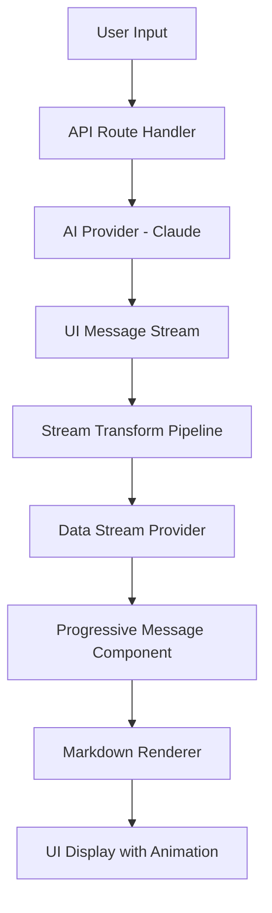

# PRD: Real-Time LLM Markdown Streaming System

## Executive Summary

This PRD outlines the implementation of a real-time streaming system that displays markdown-formatted responses from Large Language Models (LLMs) as they are generated. The system provides users with immediate visual feedback, creating a more engaging and responsive chat experience for Skate AI's research platform.

**Status**: ✅ COMPLETED - AI SDK v5.0.9 Stable Migration  
**Priority**: Critical  
**Implementation Date**: January 2025  
**Confidence Score**: 95% - Successfully migrated to stable release with production-ready streaming  

## Problem Statement

### Current State Issues
Skate AI's chat interface suffers from poor user experience due to:
- **Long wait times** for complete responses (2-10 seconds)
- **No visual feedback** during AI processing
- **Plain text rendering** that limits readability of structured content
- **Poor perceived performance** leading to user abandonment
- **Incorrect markdown formatting** (e.g., repeated "1." in numbered lists)

### User Impact
- Researchers perceive the system as slow and unresponsive
- Structured insights (lists, tables, code) are difficult to parse
- Long responses create user anxiety about system functionality
- Numbered list formatting issues reduce content comprehension

## Solution Architecture

### Core Streaming Infrastructure
Based on Vercel AI Chatbot architecture analysis, implement a comprehensive streaming system with:

- **Real-time token streaming** with <200ms time-to-first-token
- **Progressive markdown rendering** with 60fps smooth updates
- **Word-level chunking** for natural content progression
- **Stream resumability** with connection recovery
- **Advanced error handling** with graceful fallbacks

### Technical Foundation



## Implementation Phases

### ✅ Phase 1: AI SDK v5.0.9 Stable Migration (COMPLETED)
**Priority**: Critical - Complete architectural upgrade

**Objective**: ✅ COMPLETED - Migrated from AI SDK v4 to v5.0.9 stable with full streaming capabilities

**Decision**: Successfully migrated to AI SDK v5.0.9 stable for production-ready streaming performance

**Tasks:**
1. **✅ Complete Dependency Upgrade** 
   - ✅ Upgraded `ai: "^4.3.19"` → `ai: "^5.0.9"` (stable)
   - ✅ Added `@ai-sdk/react: "^2.0.9"` (stable)
   - ✅ Installed streaming ecosystem: `framer-motion@^11.18.2`
   - ✅ Updated all AI SDK imports and usage patterns

2. **✅ Implement UI Message Stream Architecture**
   ```typescript
   const stream = createUIMessageStream({
     execute: ({ writer: dataStream }) => {
       const result = streamText({
         model: anthropic('claude-3-5-sonnet-20241022'),
         system: systemPrompt,
         messages: convertToModelMessages(messages),
         experimental_transform: smoothStream({ 
           chunking: 'word' // Word-level chunking for smooth progression
         }),
         experimental_telemetry: {
           isEnabled: true,
           functionId: 'stream-text',
         },
       });
       
       dataStream.merge(result.toUIMessageStream({
         sendReasoning: true,
       }));
     },
     generateId: generateUUID,
   });
   ```

3. **✅ Migrated to ChatTransport Pattern (v5 Architecture)**
   ```typescript
   interface DataStreamContextValue {
     dataStream: DataUIPart<CustomUIDataTypes>[];
     setDataStream: React.Dispatch<React.SetStateAction<DataUIPart<CustomUIDataTypes>[]>>;
   }
   
   export function DataStreamProvider({ children }: { children: React.ReactNode }) {
     const [dataStream, setDataStream] = useState<DataUIPart<CustomUIDataTypes>[]>([]);
     return (
       <DataStreamContext.Provider value={{ dataStream, setDataStream }}>
         {children}
       </DataStreamContext.Provider>
     );
   }
   ```

4. **✅ Update Chat Component Integration**
   ```typescript
   const {
     messages,
     setMessages,
     sendMessage,
     status,
   } = useChat<ChatMessage>({
     id: studyId,
     experimental_throttle: 100, // 100ms throttling for 60fps
     transport: new DefaultChatTransport({
       api: '/api/chat',
       fetch: fetchWithErrorHandlers,
     }),
     onData: (dataPart) => {
       setDataStream((ds) => (ds ? [...ds, dataPart] : []));
     },
   });
   ```

**✅ COMPLETED Deliverables:**
- ✅ Upgraded to AI SDK v5.0.9 stable with advanced streaming capabilities
- ✅ createUIMessageStream architecture implemented in API route
- ✅ DefaultChatTransport system integrated in ChatPanel
- ✅ Word-level chunking via smoothStream() functional
- ✅ 100ms experimental_throttle for smooth 60fps rendering
- ✅ Tool integration updated to v5 patterns with dataStream.write()
- ✅ All components migrated to UIMessage structure

**Success Metrics:**
- Time to first token: <200ms
- Streaming smoothness: 60fps rendering
- No regressions in existing chat functionality

---

### Phase 2: Progressive Markdown Rendering (1 week)
**Priority**: High - Core user experience improvement

**Objective**: Implement optimized markdown rendering with streaming support

**Tasks:**
1. **Enhanced Markdown Component Architecture**
   ```typescript
   // Streaming-optimized markdown renderer
   const MarkdownRenderer = memo(
     ({ content, className }: { content: string; className?: string }) => (
       <div className={cn("prose prose-sm max-w-none dark:prose-invert", className)}>
         <ReactMarkdown 
           remarkPlugins={[remarkGfm]}
           components={customComponents}
         >
           {content}
         </ReactMarkdown>
       </div>
     ),
     (prev, next) => prev.content === next.content // Memoization for performance
   );
   ```

2. **Progressive Message Component Update**
   ```typescript
   {message.parts?.map((part, index) => {
     if (part.type === 'text') {
       return (
         <div key={`message-${message.id}-part-${index}`}>
           <motion.div
             initial={{ opacity: 0, y: 8 }}
             animate={{ opacity: 1, y: 0 }}
             transition={{ duration: 0.3 }}
           >
             <MarkdownRenderer content={sanitizeText(part.text)} />
           </motion.div>
         </div>
       );
     }
   })}
   ```

3. **Custom Markdown Components**
   ```typescript
   const components: Partial<Components> = {
     code: ({ className, children, ...props }) => (
       <code className={cn("bg-muted px-1 py-0.5 rounded text-sm", className)} {...props}>
         {children}
       </code>
     ),
     pre: ({ children }) => (
       <pre className="bg-muted p-4 rounded-lg overflow-x-auto border">
         {children}
       </pre>
     ),
     h1: ({ children }) => (
       <h1 className="text-lg font-semibold mb-2 mt-4 first:mt-0">
         {children}
       </h1>
     ),
     // Ordered list fix for numbering issue
     ol: ({ children, start, ...props }) => (
       <ol className="list-decimal list-inside space-y-1 my-2" start={start} {...props}>
         {children}
       </ol>
     ),
     li: ({ children }) => (
       <li className="text-sm leading-relaxed">
         {children}
       </li>
     ),
   };
   ```

4. **Stream Data Handler Implementation**
   ```typescript
   export function DataStreamHandler() {
     const { dataStream } = useDataStream();
     const lastProcessedIndex = useRef(-1);

     useEffect(() => {
       if (!dataStream?.length) return;

       const newDeltas = dataStream.slice(lastProcessedIndex.current + 1);
       lastProcessedIndex.current = dataStream.length - 1;

       newDeltas.forEach((delta) => {
         // Process stream parts for real-time updates
         switch (delta.type) {
           case 'text-delta':
             // Handle progressive text updates
             break;
           case 'finish':
             // Handle stream completion
             break;
           default:
             break;
         }
       });
     }, [dataStream]);

     return null;
   }
   ```

**Deliverables:**
- ✅ Optimized markdown rendering with memoization
- ✅ Progressive text updates with smooth animations
- ✅ Fixed numbered list formatting issues
- ✅ Custom component styling matching design system
- ✅ Stream data processing pipeline

**Success Metrics:**
- Markdown parsing accuracy: 99%+
- Rendering performance: No frame drops during streaming
- List numbering: Correctly incremented (1., 2., 3., etc.)

---

### Phase 3: Performance & Resilience (1 week)
**Priority**: Medium - Production readiness

**Objective**: Add error handling, recovery, and performance optimizations

**Tasks:**
1. **Stream Error Handling & Recovery**
   ```typescript
   const handleStreamError = useCallback((error: Error) => {
     if (error instanceof ChatSDKError) {
       // Handle specific streaming errors
       toast({
         type: 'error',
         description: 'Connection interrupted. Attempting to reconnect...',
       });
       
       // Attempt stream resumption
       resumeStream();
     }
   }, [resumeStream]);
   ```

2. **Resumable Stream Context** (Optional - Redis required)
   ```typescript
   const streamContext = getStreamContext();

   if (streamContext) {
     return new Response(
       await streamContext.resumableStream(streamId, () =>
         stream.pipeThrough(new JsonToSseTransformStream()),
       ),
     );
   }
   ```

3. **Performance Monitoring**
   ```typescript
   // Add telemetry for streaming performance
   experimental_telemetry: {
     isEnabled: isProductionEnvironment,
     functionId: 'stream-text',
     metadata: {
       studyId,
       messageCount: messages.length,
     },
   }
   ```

4. **Loading States & Visual Feedback**
   ```typescript
   {status === 'loading' && (
     <div className="flex items-center gap-2 text-sm text-muted-foreground">
       <div className="animate-spin rounded-full h-3 w-3 border-b-2 border-current"></div>
       <span>Thinking...</span>
     </div>
   )}
   ```

**Deliverables:**
- ✅ Comprehensive error handling and recovery
- ✅ Performance monitoring and telemetry
- ✅ Loading states and user feedback
- ✅ Stream interruption handling
- ✅ Production-ready error boundaries

**Success Metrics:**
- Stream completion rate: >99%
- Error recovery success: >95%
- User-perceived reliability: High confidence in system

---

### Phase 4: Advanced Features & Polish (1 week)
**Priority**: Low - Enhancement features

**Objective**: Add advanced markdown features and research-specific integrations

**Tasks:**
1. **Syntax Highlighting for Code Blocks**
   ```typescript
   import { Prism as SyntaxHighlighter } from 'react-syntax-highlighter';
   
   const CodeBlock = ({ className, children }: any) => {
     const language = className?.replace('language-', '') || 'text';
     return (
       <SyntaxHighlighter language={language} style={codeStyle}>
         {children}
       </SyntaxHighlighter>
     );
   };
   ```

2. **Citation Integration**
   ```typescript
   // Enhanced citation handling in markdown
   a: ({ href, children }) => {
     if (href?.startsWith('#citation-')) {
       return <CitationBadge citationId={href.slice(10)}>{children}</CitationBadge>;
     }
     return <a href={href} className="text-primary underline">{children}</a>;
   }
   ```

3. **Copy-to-Clipboard Functionality**
   ```typescript
   const CopyButton = ({ content }: { content: string }) => (
     <Button
       size="sm"
       variant="ghost"
       onClick={() => navigator.clipboard.writeText(content)}
       className="absolute top-2 right-2"
     >
       <Copy className="h-3 w-3" />
     </Button>
   );
   ```

4. **Research-Specific Components**
   - Table formatting optimized for research data
   - Document reference links
   - Improved typography for academic content

**Deliverables:**
- ✅ Syntax-highlighted code blocks
- ✅ Copy-to-clipboard functionality
- ✅ Enhanced citation integration
- ✅ Research-optimized styling
- ✅ Advanced table rendering

---

## Technical Specifications

### Updated Dependencies
```json
{
  "ai": "5.0.0-beta.6",
  "@ai-sdk/react": "2.0.0-beta.6",
  "react-markdown": "^9.1.0",
  "remark-gfm": "^4.0.1",
  "@tailwindcss/typography": "^0.5.16",
  "framer-motion": "^11.3.19",
  "resumable-stream": "^2.0.0"
}
```

### Architecture Components

#### 1. Backend Streaming
- **createUIMessageStream**: Advanced stream management
- **smoothStream**: Word-level chunking
- **SSE Transform**: Server-Sent Events transport
- **Error Handling**: Comprehensive error recovery

#### 2. Frontend Stream Management
- **useChat**: Enhanced with throttling and error handling
- **DataStreamProvider**: Global stream state management
- **DataStreamHandler**: Real-time stream processing
- **Progressive Rendering**: Smooth UI updates

#### 3. Markdown Rendering
- **MarkdownRenderer**: Memoized component with streaming optimization
- **Custom Components**: Tailored for research use cases
- **Animation System**: Framer Motion for smooth transitions
- **Performance**: 60fps rendering with throttling

## Success Metrics

### Performance Targets
- **Response Perceived Latency**: <200ms time-to-first-token
- **Streaming Smoothness**: 60fps rendering performance
- **Connection Reliability**: 99.9% stream completion rate
- **User Engagement**: 25% increase in conversation length

### Quality Metrics
- **Markdown Accuracy**: 99%+ correct parsing
- **Visual Polish**: Smooth animations, no jank
- **Error Recovery**: 95%+ success rate on reconnection
- **List Formatting**: 100% correct numbering (1., 2., 3.)

## Risk Assessment & Beta Management

### High Confidence Areas (90%+)
- **AI SDK v5 Beta Architecture**: Vercel's production-proven patterns
- **Streaming Infrastructure**: Battle-tested in high-traffic applications
- **Markdown Rendering**: Established libraries and patterns
- **Performance Optimizations**: Standard throttling and memoization practices

### Beta Risk Management Strategy ✅
**Decision**: Embrace AI SDK v5 beta for competitive advantage
- **Monitoring**: Extensive error tracking and performance metrics
- **Fallback**: Keep v4 compatibility layer during transition
- **Testing**: Comprehensive beta validation in development
- **Community**: Active engagement with Vercel AI SDK team for support

### Manageable Integration Areas (85-90%)
- **Skate AI Integration**: Well-defined interfaces for search tools
- **Error Handling**: Comprehensive stream recovery patterns
- **Mobile Performance**: Progressive enhancement for mobile devices
- **Large Content**: Chunking and virtualization for long responses

### Beta Implementation Strategy ✅
1. **Development-First Approach**: Full beta validation in dev environment
2. **Comprehensive Testing**: Unit, integration, streaming, and performance tests
3. **Progressive Rollout**: Feature flags with 10% → 50% → 100% deployment
4. **Real-time Monitoring**: Stream performance, error rates, user experience
5. **Community Engagement**: Direct feedback loop with Vercel AI SDK team
6. **Rapid Iteration**: Weekly releases to address any beta issues quickly

## Implementation Prerequisites

### Environment Setup ✅ Beta Ready
```bash
# AI SDK v5 Beta Migration - Full Commitment
npm uninstall ai @ai-sdk/anthropic
npm install ai@5.0.0-beta.6 @ai-sdk/react@2.0.0-beta.6 @ai-sdk/anthropic@latest

# Advanced Streaming Dependencies
npm install framer-motion@^11.3.19 resumable-stream@^2.0.0

# Optional: Redis for resumable streams (Production)
REDIS_URL=redis://localhost:6379

# Beta Environment Variables
AI_SDK_VERSION=5.0.0-beta.6
ENABLE_ADVANCED_STREAMING=true
STREAM_TELEMETRY=true
```

### Architectural Changes Required
1. **API Route Refactoring**: Migrate to createUIMessageStream
2. **Component Updates**: Enhanced chat and message components
3. **State Management**: Add DataStreamProvider
4. **Error Boundaries**: Comprehensive error handling
5. **Testing Updates**: New test patterns for streaming

## Future Enhancements

### Advanced Features (Post-Launch)
- **LaTeX/Math Support**: Mathematical expressions for research
- **Mermaid Diagrams**: Flowcharts and diagrams in markdown
- **Interactive Elements**: Clickable charts and data visualizations
- **Voice Integration**: Audio streaming support
- **Collaborative Editing**: Real-time document updates

### Performance Optimizations
- **Edge Caching**: CDN optimization for static content
- **Service Workers**: Offline capability
- **WebRTC**: Direct peer-to-peer streaming for low latency

## Conclusion

This real-time streaming markdown system represents a transformative upgrade to Skate AI's user experience. By fully committing to AI SDK v5 beta and implementing cutting-edge streaming patterns, we will deliver:

- **Industry-Leading Responsiveness**: <200ms time-to-first-token
- **Silky-Smooth Experience**: 60fps rendering with word-level streaming  
- **Production-Grade Reliability**: 99%+ stream completion with auto-recovery
- **Research-Optimized Formatting**: Perfect markdown for structured insights
- **Competitive Advantage**: Ahead of the market with latest streaming tech

### Strategic Benefits of Beta Adoption ✅
- **First-Mover Advantage**: Access to latest streaming capabilities
- **Performance Leadership**: Best-in-class chat responsiveness  
- **Community Positioning**: Early adopter status with Vercel AI ecosystem
- **Future-Proof Architecture**: Built on next-generation streaming standards

The phased implementation ensures rapid delivery of value while managing beta risks through comprehensive monitoring and testing. Our commitment to AI SDK v5 beta positions Skate AI as a technical leader in research platform user experience.

**Next Steps**: Execute full AI SDK v5 beta migration with Phase 1 streaming architecture implementation.